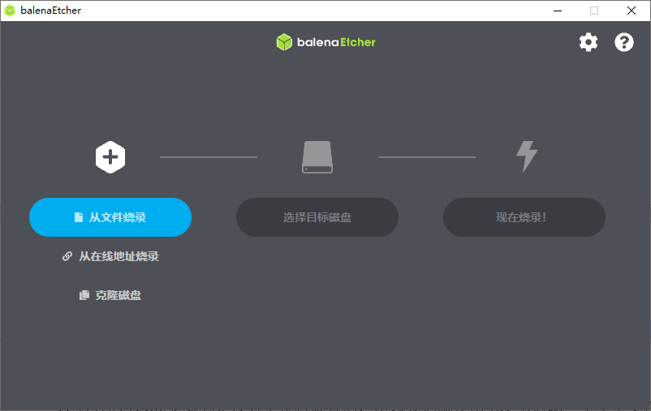
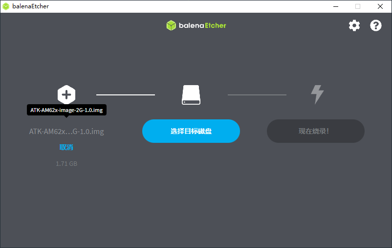
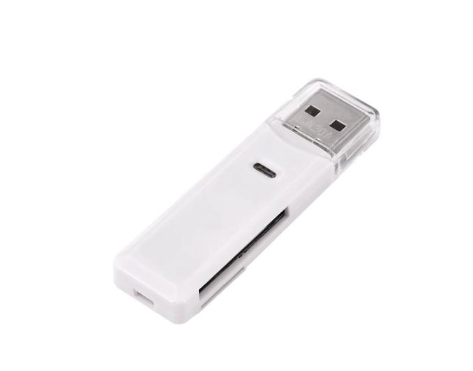
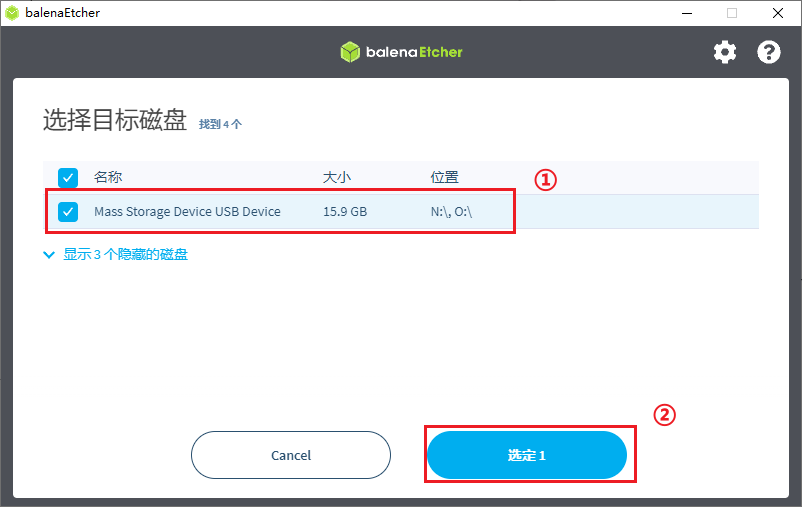
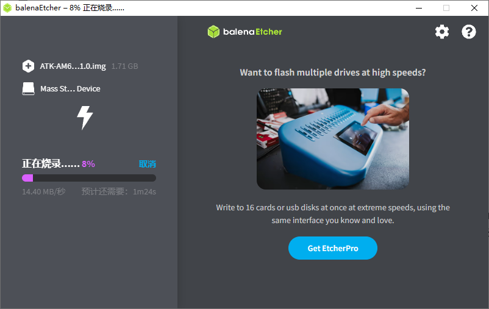
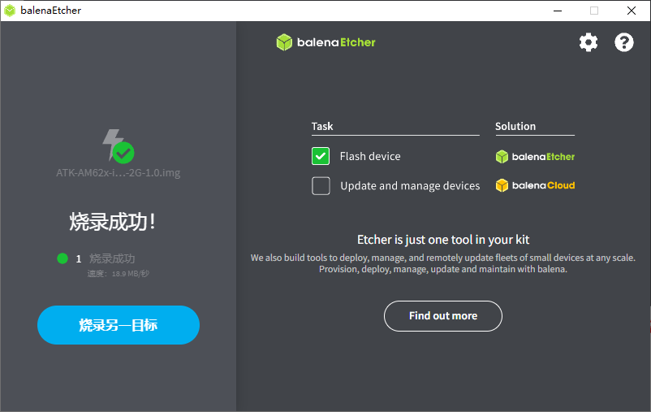
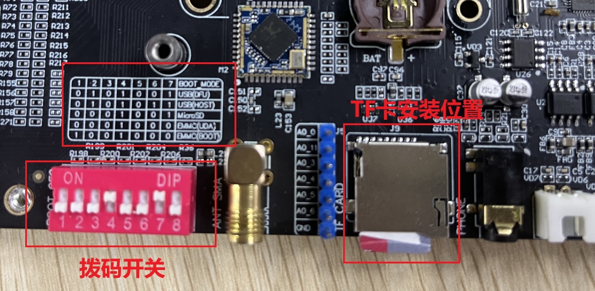
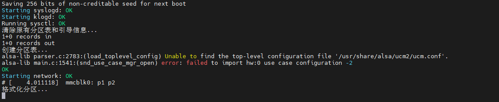
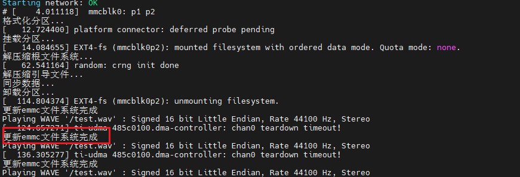
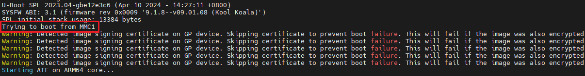

# 3.1 出厂系统固化

&emsp;&emsp;TI官方的AM62x系列是没有上位机烧录的，所以我们就使用SD卡启动一个小型文件系统，在此文件系统下进行emmc的系统固化。

&emsp;&emsp;AM62X开发板开发板光盘A盘-基础资料03、软件 balenaEtcher-Portable-1.18.4.exe 此文件是一个直接运行的软件不用安装(笔者只在win10系统下测试过可以正常使用，如果是其它版本的请自行在https://etcher.balena.io/下载)。

&emsp;&emsp;双击打开此文件，如下图所示：

&emsp;&emsp;镜像目录为：AM62X开发板开发板光盘A盘-基础资料08、系统镜像 ATK-AM62x-image-1G-1.0.img(ATK-AM62x-image-2G-1.0.img)，笔者做了AM2654、AM6252和AM6231的芯片镜像兼容。所以大家购买不同版本的AM62系列只要关注是1G版本还是2G版本即可。这里根据购买的版本选择1G或者2G，这里笔者就以2G为例，点击“**从文件烧录**”选择加载对应的固件，如下图所示：

&emsp;&emsp;使用上图的读卡器，安装TF卡，连接电脑上，需要把TF卡挂载到Windows系统下，点击“**选择目标磁盘**”，就会出现我们的TF卡磁盘，如下图所示：

&emsp;&emsp;在步骤一里就可以看到我们TF卡的信息，如果没有看看TF卡是否挂载到Ubuntu系统下或者可能USB接口不行。按照步骤操作即可。点击“现在烧录！”，就出现下图所示：

&emsp;&emsp;烧录成功会弹出Windows的格式窗口，**不要点击格式化，不要点击格式化，不要点击格式化**。成功如下图所示：

&emsp;&emsp;读卡器断开Windows系统，把TF卡接到ATK-DLAM62x开发板上，如下图所示：

&emsp;&emsp;在上图中，笔者把TF卡安装到ATK-DLAM62x开发板上了。左边是8路拨码开关(**拨码开关只用到1-7位，第8位直接设置为0即可**)，通过拨不同的高低电平实现不同的启动，拨码开关上有个表格，描述了如何启动。

<table class="dlam62x_center-table">
  <tr>
    <th>BOOT_MODE</th>
    <th>拨码开关(ON为1)</th>
  </tr>
  <tr>
    <td>USB DFU模式(OTG从模式)</td>
    <td>01010010</td>
  </tr>
  <tr>
    <td>USB MSC模式(OTG 主模式，接U盘)</td>
    <td>01010110</td>
  </tr>
  <tr>
    <td>SD卡模式(MicroSD)</td>
    <td>00010010</td>
  </tr>
  <tr>
    <td>EMMC模式(UDA)</td>
    <td>00010000</td>
  </tr>
  <tr>
    <td>EMMC模式(BOOT)</td>
    <td>10010000</td>
  </tr>
</table>

&emsp;&emsp;注意这里有两个EMMC模式分别为：UDA和BOOT模式。

&emsp;&emsp;UDA模式（User Data Area）： 
   - 在UDA模式下，emmc被分为两个区域：用户数据区(rootfs)和引导区(boot)。 
   - 用户数据区用于存储用户生成的数据，例如文件、媒体内容等。 
   - 引导区用于存储设备的引导程序和操作系统相关的文件。

&emsp;&emsp;BOOT模式： 
   - BOOT模式是emmc中用于引导启动设备的模式。 
   - 在BOOT模式下，emmc被用作启动设备，其中包含引导加载程序和操作系统映像。 
   - BOOT模式允许设备在启动时从emmc中加载引导加载程序，并启动操作系统。 

&emsp;&emsp;UDA模式就是主控读取emmc的引导分区，去加载需要的启动文件。 

&emsp;&emsp;BOOT模式EMMC里面有两个隐藏分区分别为BOOT1和BOOT2，主控去这两个分区读取启动文件。这个两个分区操作起来比较麻烦，笔者推荐使用UDA模式方便。

&emsp;&emsp;把拨码开关设置为SD卡启动如上图所示。接上串口(选择SERIAL-B)和电源。串口就有以下打印信息：

&emsp;&emsp;可以看到开发板的红色灯，在闪烁，如果烧录完成就会停止闪烁，变成长亮。同时喇叭会播放“系统烧录完成，请断开电源”。终端也有以下打印信息。

&emsp;&emsp;可以断开电源，修改拨码开关为“00010000”EMMC的UDA模式。

&emsp;&emsp;从串口打印信息可以看出我们的启动模式为emmc。如下图所示：

&emsp;&emsp;MMC1就是emmc启动。

