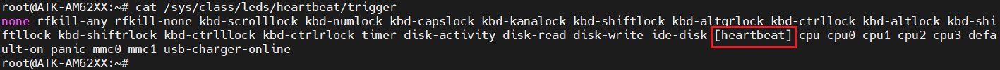

# 4.1 LED测试

&emsp;&emsp;ATK-DLAM62x开发板配备了三个LED灯，分别是DS1、DS2和DS3。其中，DS1是由A核（A53架构）控制的LED，DS2则是由M4F核（M4架构）控制的LED，而DS3则由R5核控制的LED。这样的设计使得开发者能够便捷地通过不同的核心来独立控制各个LED灯。 

&emsp;&emsp;在出厂系统输入如下指令，控制DS1。查看当前系统的DS1灯的触发方式

```c#
cat /sys/class/leds/heartbeat/trigger			//查看DS1的当前触发方式及支持的触发方式
```

&emsp;&emsp;运行结果如下图所示：

<center>
<br />
图 4.1.1 查看触发方式
</center>


&emsp;&emsp;可以看出此时的DS1，触发方式为[heartbeat]表示当前的触发条件为系统心跳灯，修改trigger的字符串即可修改触发方式。命令如下所示： 

```c#
echo none > /sys/class/leds/heartbeat/trigger //改变DS1的触发方式，设置为none
```

&emsp;&emsp;以下命令进行控制DS1灯。

```c#
echo 1 > /sys/class/leds/heartbeat/brightness //熄灭DS1
echo 0 > /sys/class/leds/heartbeat/brightness //点亮DS1
```

&emsp;&emsp;DS1连接CPU的IO为GPIO0_13(H21)，设备树在内核源码：**atk-linux-kernel-6.1.46/arch/arm64/boot/dts/alientek/alientek-am62xx-common.dtsi**。在根节点下(/)找到leds节点，如下示例代码所示：

```c#
示例代码4.1.1 alientek-am62xx-common.dtsi
1     leds {
2         compatible = "gpio-leds";
3         pinctrl-names = "default";
4         pinctrl-0 = <&usr_led_pins_default>;
5         led-0 {
6             label = "heartbeat";
7             gpios = <&main_gpio0 13 PIO_ACTIVE_LOW>;
8             linux,default-trigger = "heartbeat";
9             function = LED_FUNCTION_HEARTBEAT;
10            default-state = "on";
11        };
12    };
```

&emsp;&emsp;如果想出厂系统关闭DS1，修改第8行，把"heartbeat"改为"none"，第10行，on修改为off。重新编译设备树。驱动文件在Linux源码目录下：drivers/leds/leds-gpio.c。


