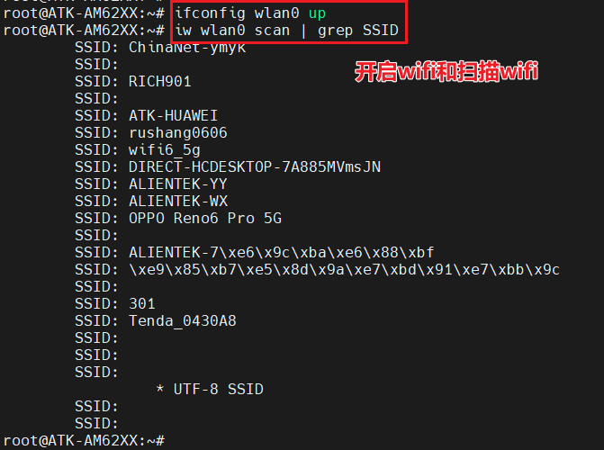
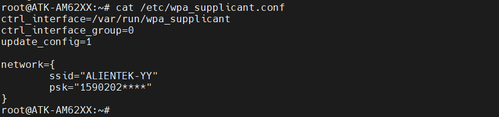
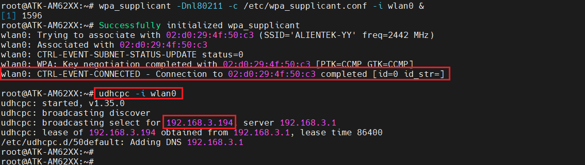
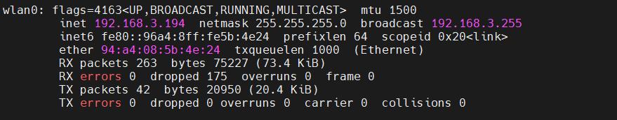
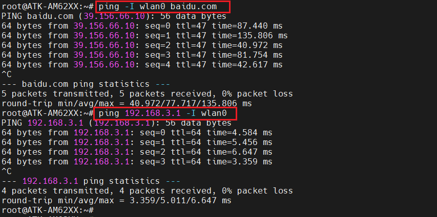
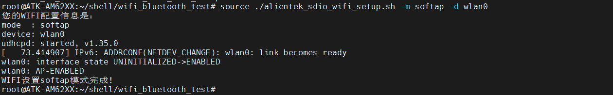
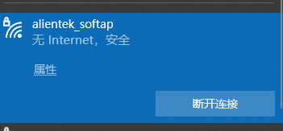
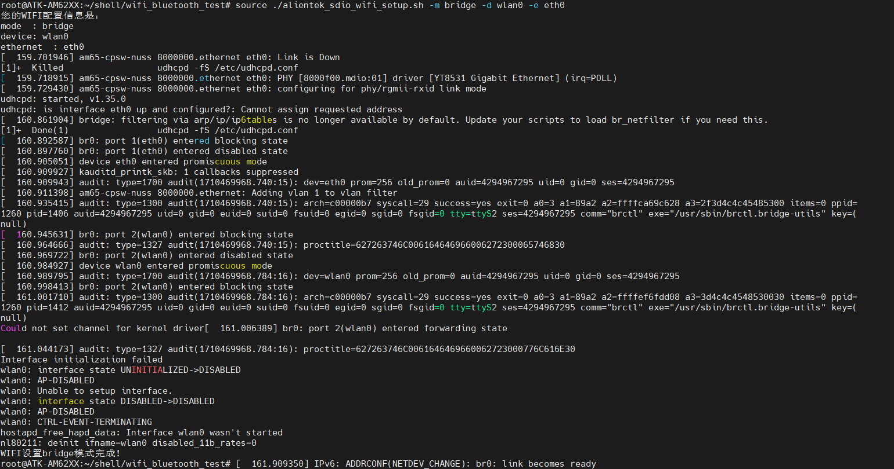
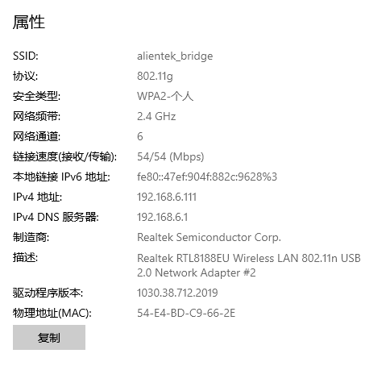

# 4.10 板载SDIO WiFi测试


&emsp;&emsp;RTL8723DS是一款高性能的Wi-Fi和蓝牙二合一芯片，集成于ATK-DLAM62x开发板上。它采用SDIO接口，确保数据传输的高效与稳定。RTL8723DS支持最新的蓝牙4.2标准和强大的Wi-Fi功能，为用户提供了出色的无线连接体验。无论是在开发板、智能家居还是其他物联网设备中，RTL8723DS都能发挥出色的性能，轻松实现设备间的数据传输与通信。其高兼容性和易用性也使得开发人员能够轻松集成和调试，提升了开发效率。 

## 4.10.1 上网(Station)模式测试

&emsp;&emsp;扫描WIFI热点，使用文件系统提供的iw指令可扫描出热点名称。如果要查看完整的热点信息，先开启wlan0，使用iw wlan0 scan指令，这里使用grep过滤掉了一些信息。

```c#
ifconfig wlan0 up
iw wlan0 scan | grep SSID
```

<center>
<br />
图4.10.1.1 扫描热点
</center>

&emsp;&emsp;如下图扫描出热点名称“ALIENTEK-YY”，其中“\xe9\x85\...”是因为带中文字符显示不出来。所以用户的热点最好是由英文字符组成。

&emsp;&emsp;编辑要连接的热点信息，将/etc/wpa_supplicant.conf修改成如下,输入:wq保存退出。请修改个人热点的ssid，及psk。

&emsp;&emsp;ssid: 为无线网络名称<br />
&emsp;&emsp;psk：为无线网络密码

```c#
vi /etc/wpa_supplicant.conf
```

&emsp;&emsp;输入以下内容。

```c#
ctrl_interface=/var/run/wpa_supplicant
ctrl_interface_group=0
update_config=1

network={
        ssid=" ALIENTEK-YY "
psk="1590202****"
}
```

&emsp;&emsp;如果热点是无密码的则需要将/etc/wpa_supplicant.conf，改成如下

```c#
ctrl_interface=/var/run/wpa_supplicant
ctrl_interface_group=0
update_config=1

network={
        ssid=" ALIENTEK-YY "
        key_mgmt=NONE
}
```

&emsp;&emsp;**wpa_supplicant.conf还有很多种连接配置，其它的连接配置请自行百度。**


<center>
<br />
图4.10.1.2 配置wpa_supplicant.conf
</center>

&emsp;&emsp;执行下面的指令连接热点及获取ip。

```c#
wpa_supplicant -Dnl80211 -c /etc/wpa_supplicant.conf -i wlan0 &
udhcpc -i wlan0
```

&emsp;&emsp;命令解释：<br />
&emsp;&emsp;-Dnl80211：指定wifi驱动为nl80211。<br />
&emsp;&emsp;-c /etc/wpa_supplicant.conf: 指定配置文件为/etc/wpa_supplicant.conf。<br />
&emsp;&emsp;-I wlan0：指定wlan0的网络。

<center>
<br />
图4.10.1.3 连接成功，获取到IP
</center>

&emsp;&emsp;看到如上结果，已经连接到WIFI热点，及获取到ip信息。也可以用ifconfig指令查看我们的wlan0所获取的ip地址。

<center>
<br />
图4.10.1.4 查看获取到的IP地址
</center>

&emsp;&emsp;ping百度测试连通性，也可以ping网关来测试WIFI的连通性。备注：如果ping不通百度，请重启开发板，不要插网线，重新连接WIFI即可！因为系统会默认只让一个网络设备连通外网。

```c#
ping www.baidu.com -I wlan0
ping 192.168.3.1 -I wlan0
```

<center>
<br />
图4.10.1.5 ping百度测试
</center>

## 4.10.2 热点(SoftAP)模式测试

&emsp;&emsp;我们可以把板子上的SDIO WIFI开启热点，让其他手机（或者其他板子）连接到这个热点上。这样可以将手机（或其他板子）与开发板连接，构成一个局域网，可以通过TCP、UDP等与ATK-DLAM62X板子进行通信。如果不了解什么是TCP和UDP通信，建议自行找资料看看。

&emsp;&emsp;直接在跳转到/home/root/shell/wifi_bluetooth_test目录执行如下指令

```c#
source ./alientek_sdio_wifi_setup.sh -m softap -d wlan0
```

<center>
<br />
图4.10.2.1 ap模式的热点配置
</center>

&emsp;&emsp;热点名字为“alientek_softap”，默认密码为12345678。要修改热点名称和密码，请自行打开alientek_sdio_wifi_setup.sh脚本修改即可。

&emsp;&emsp;这个模式下手机可以连接WiFi，不能分配IP地址。

<center>
<br />
图4.10.2.2 连接WiFi
</center>

## 4.10.3 桥接(Bridge) 模式测试

&emsp;&emsp;进行桥接模式前请确认底板网口已经插上网线，并且能通过网线上网！原理是底板WIFI开启热点，将热点桥接到网口上，手机可以连接上这个热点进行上网。

&emsp;&emsp;执行下面的指令开启桥接模式。如果上面已经开启了热点模式，想切换到桥接模式，那么我们需要执行下面的指令，防止切换桥接模式不成功。热点名称为“alientek_bridge”，密码为“12345678”。手机就可以连接上这个热点上网了！

```c#
source ./alientek_sdio_wifi_setup.sh -m bridge -d wlan0 -e eth0
```

<center>
<br />
图4.10.3.1 开启桥接模式
</center>

&emsp;&emsp;手机连接此热点，自动获取ip后就可以上网了。如果家中有网线没路由器，可以借此开发板开启热点来使用啦！

&emsp;&emsp;电脑连接如下图所示：

<center>
<br />
图4.10.3.2 电脑连接WIFI的桥接模式
</center>

&emsp;&emsp;图4.10.3.2中正确的分配IP地址192.168.6.111，此时我们电脑就可以通过网络接口进行上网了。


