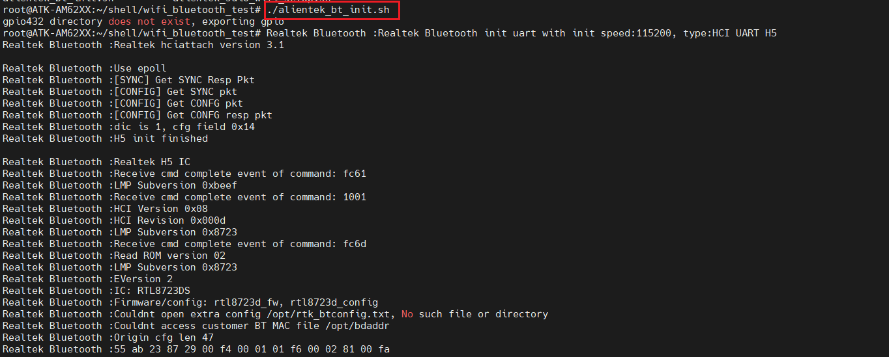
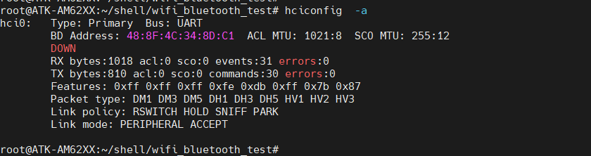

# 4.11 板载蓝牙测试


&emsp;&emsp;RTL8723DS蓝牙模块是一款集成了Wi-Fi和蓝牙4.2功能的二合一模块，性能出色，兼容性强，可广泛应用于各类设备中。它采用PIN对PIN设计，替换便捷，支持多种操作系统和开发环境，为用户带来高效、稳定的无线连接体验。

&emsp;&emsp;直接在跳转到/home/root/shell/wifi_bluetooth_test目录执行如下指令：

```c#
./alientek_bt_init.sh
```

<center>
<br />
图4.11.1 蓝牙初始化
</center>

&emsp;&emsp;运行以下代码即可查看蓝牙功能是否开启：

```c#
hciconfig  -a
```

<center>

</center>


