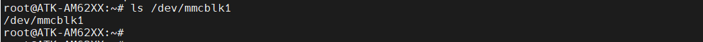
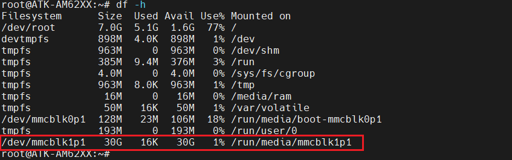
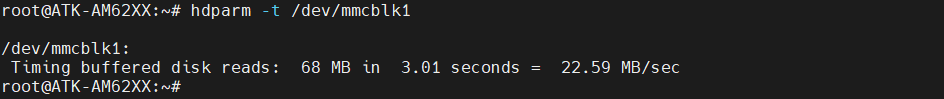
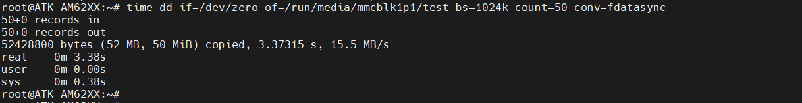
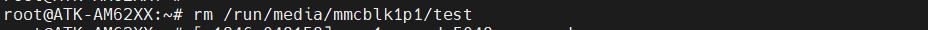

# 4.13 TF(SD)卡测试


&emsp;&emsp;指令提示：<br />
&emsp;&emsp;time命令常用于测量一个命令的运行时间，dd 用于复制，从 if(input file)文件读出，写到 of(output file)指定的文件，bs 是每次写块的大小，count 是读写块的数量。"if=/dev/zero"不产生 IO，即可以不断输出数据，因此可以用来测试纯写速度。

&emsp;&emsp;需要准备TF卡<br />
&emsp;&emsp;开发板启动后将TF卡插到开发板底板卡槽处。开发板会将TF卡自动挂载。TF卡有多少个分区就挂载多少个

&emsp;&emsp;作者是从EMMC启动，可以看到/dev/mmcblk1就是TF卡的设备节点，系统将/dev/mmcblk1p1挂载到/run/media/ mmcblk1p1目录下。（注意需要使用FAT32格式的TF卡，不能使用NTFS格式）。

```c#
ls /dev/mmcblk1
```

<center>
<br />
图4.13.1 查看TF卡的节点
</center>

&emsp;&emsp;使用df命令查看TF卡挂载的目录。笔者使用是一张空白的TF卡，那么就只有一个分区，名称为“/dev/mmcblk1”，挂载的目录为“/run/media/mmcblk1”。

```c#
df -h
```

<center>
<br />
图4.13.2 查看TF卡的挂载目录
</center>

## 4.13.1 读取速度测试

&emsp;&emsp;常用于测试硬盘读取速度指令有hdparm与dd，本次只演示hdparm读取TF卡的速度。（读取速度与你所用的TF卡类型有关）

```c#
hdparm -t /dev/mmcblk1
```

<center>
<br />
图4.13.1.1 读取速度测试
</center>

## 4.13.2 写速度测试

&emsp;&emsp;使用dd指令写50MB数据到“/run/media/mmcblk1p1”目录，”也就是TF卡的挂载目录。如果您的TF卡是系统启动卡，只有二个分区，那么，挂载的目录就有两个请自行挑选测试，请修改下面的指令。注意，写的数据越大数据，写入的速度越接近实际值。

```c#
time dd if=/dev/zero of=/run/media/mmcblk1p1/test bs=1024k count=50 conv=fdatasync
```

<center>
<br />
图4.13.2.1 写速度测试
</center>

&emsp;&emsp;测试完成删除“/run/media/mmcblk1p5”目录下的test文件。

```c#
rm /run/media/mmcblk1p1/test
```

<center>
<br />
图4.13.2.2 删除写入文件
</center>


