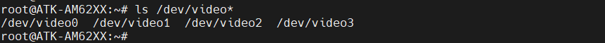

# 4.14 OV5645测试


&emsp;&emsp;实验前请准备ov5645摄像头模块（500万像素），本公司的任何分辨率的RCB LCD电容屏。

&emsp;&emsp;摄像头插法：<br />
&emsp;&emsp;摄像头镜头往开发板外则直接插到CAMERA接口处。由于没有防反插设计，插摄像头时需要注意看底板丝印，按引脚编号对应插上，即镜头朝向板子外侧。

&emsp;&emsp;开机前先插上摄像头(不支持热插拔)，uEnv.txt里面需要添加alientek-am62xx-csi-ov5645.dtbo(出厂系统默认添加)


<center>
<br />
图4.14.1.1 查看uEnv.txt文件
</center>

&emsp;&emsp;使用以下命令去，确定ov5645摄像头是否正确加载：

```c#
dmesg | grep 5645
```

<center>
<br />
图4.14.1.2 启动时5645驱动打印的信息
</center>

&emsp;&emsp;查看ov5645生成的节点。

```c#
ls /dev/video*
```

<center>
<br />
图4.14.1.3 生成的摄像头节点
</center>

&emsp;&emsp;注意：AM62XX是默认不支持ov5645摄像头，本驱动是正点原子进行修改，适配到ATK-AM52XX开发板上，只支持部分功能。

&emsp;&emsp;下面的命令只能启动设置一次，驱动没有添加动态调节MIPI的速度。

```c#
media-ctl --set-v4l2 '"ov5645 2-003c":0 [fmt:UYVY8_1X16/640x480@1/30]'
media-ctl --set-v4l2 '"ov5645 2-003c":0 [fmt:UYVY8_1X16/720x4880@1/45]'
media-ctl --set-v4l2 '"ov5645 2-003c":0 [fmt:UYVY8_1X16/1280x720@1/60]'
media-ctl --set-v4l2 '"ov5645 2-003c":0 [fmt:UYVY8_1X16/1280x960@1/30]'
media-ctl --set-v4l2 '"ov5645 2-003c":0 [fmt:UYVY8_1X16/1920x1080@1/30]'
media-ctl --set-v4l2 '"ov5645 2-003c":0 [fmt:UYVY8_1X16/2592x1944@1/15]'
```

&emsp;&emsp;比如笔者测试1920x1080分辨率，需要先输入1920x1080这个分辨率的配置。测试前请先退出QT界面，命令如下所示：

```c#
media-ctl --set-v4l2 '"ov5645 2-003c":0 [fmt:UYVY8_1X16/1920x1080@1/30]'
gst-launch-1.0 v4l2src device="/dev/video0" ! video/x-raw, width=1920, height=1080, format=UYVY ! queue ! autovideosink
gst-launch-1.0 v4l2src device="/dev/video0" ! video/x-raw, width=1920, height=1080, format=UYVY ! queue ! kmssink driver-name=tidss plane-properties=s,zpos=1
```

<center>
<br />
图4.14.1.4 摄像头显示测试
</center>

## 4.14.2 USB摄像头测试

&emsp;&emsp;出厂系统默认支持USB摄像头，在开发板启动后，接上USB摄像头，就会以下打印信息

<center>
<br />
图4.14.2.1 USB摄像头打印信息
</center>

&emsp;&emsp;运行以下命令查看USB支持的格式和分辨率

```c#
v4l2-ctl -d /dev/video4 --list-formats-ext
```

&emsp;&emsp;注意：笔者这里接上OV5645摄像头，所以USB摄像头的节点为“/dev/video4”。如果没有接上USB摄像头，节点为“/dev/video0”。运行命令如下所示：

<center>
<br />
图4.14.2.2 查看USB摄像头
</center>


