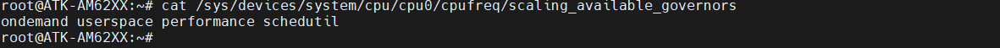
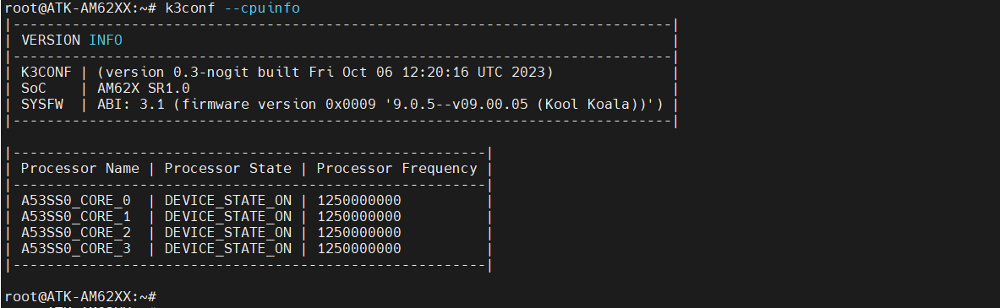
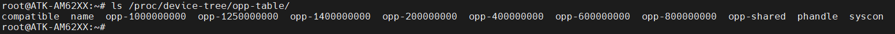
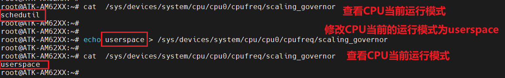
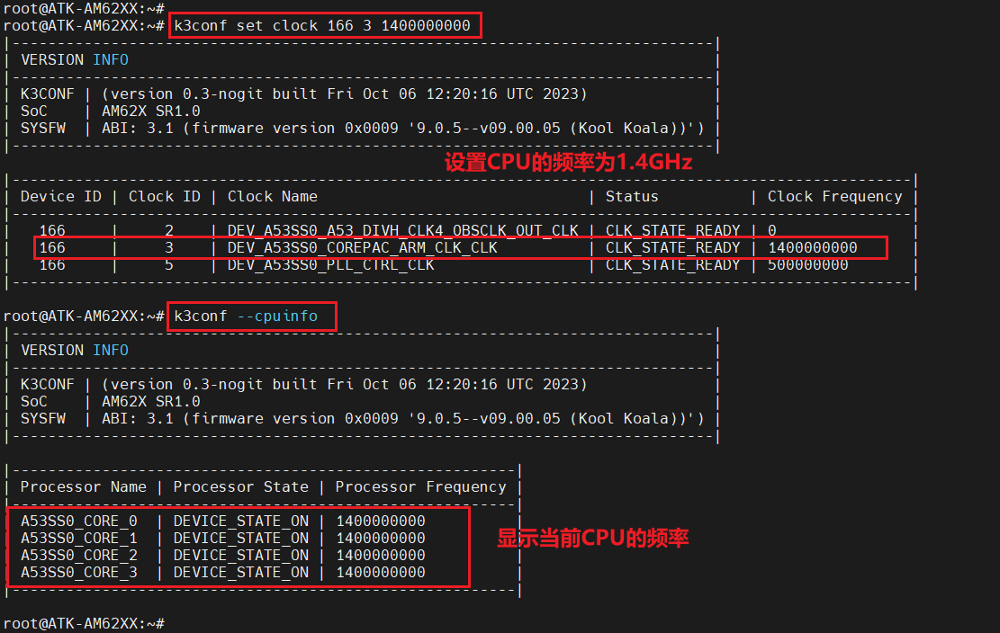

# 4.16 CPU主频


&emsp;&emsp;ATK-DLAM62X开发板处理器最高支持1.4GHz主频。通过调整VDD_CORE电压值，可以管理CPU的最大频率。出厂系统开启了CPU动态调节功能，默认的功能模式为“schedutil”模式。运行以下命令查看CPU支持那些动态模式：

```c#
cat /sys/devices/system/cpu/cpu0/cpufreq/scaling_available_governors
```

&emsp;&emsp;运行结果如下图所示：


<center>
<br />
图4.16.1 查看CPU的工作模式
</center>

&emsp;&emsp;图4.16.1中可以看出，一共支持4种模式：ondemand、userspace、performance和schedutil。

&emsp;&emsp; - ondemand模式：(按需模式)此模式下，CPU频率会根据系统的负载情况动态调整。当系统负载较低时，CPU频率会降低以节省能量；当系统负载较高时，CPU频率会提高以提供更好的性能。<br />
&emsp;&emsp; - userspace模式：(用户态模式)在这种模式下，用户可以手动控制CPU的频率。用户可以通过特定的工具或命令来设置CPU的频率，而不依赖于系统自动调节。<br />
&emsp;&emsp; - performance模式：(性能模式)这是一种高性能模式，CPU会工作在最高频率，以提供最大的计算能力。这个模式适用于需要最大性能的任务，但可能会消耗更多的能量。<br />
&emsp;&emsp;schedutil模式：(调度器模式)这是Linux内核中较新的一种调度器模式，它尝试根据系统的工作负载动态选择合适的CPU频率。它的目标是在提供良好性能的同时，尽量减少能耗和热量。<br />
(**注意：schedutil模式调速快(周期在1ms级)，CPU频率升得快，降得也快，此模式最适合动态调节**)

&emsp;&emsp;运行以下命令，查看出厂系统的CPU频率(**k3conf此命令是TI芯片系列特有的，具体的详细使用方法请自行研究**)：

```c#
k3conf –cpuinfo
```

&emsp;&emsp;查看结果如下图所示：

<center>
<br />
图4.16.2 查看CPU频率
</center>

&emsp;&emsp;图4.16.2中可以看出CPU此时跑的速度为1.25GH	z，可以用以下命令查看CPU支持那些频率

```c#
ls /proc/device-tree/opp-table/
```

&emsp;&emsp;运行结果如下图所示：

<center>
<br />
图4.16.3查看CPU支持频率
</center>

&emsp;&emsp;图4.16.3中可以ATK-DLAM62X开发板支持：200MHz、400MHz、600MHz、800MHz、1GHz、1.25GHz和1.4GHz。平时CPU默认是跑1.25GHz。如果跑高负载的时候CPU频率就会调节到1.4GHz。

&emsp;&emsp;通过命令切换CPU不同的工作模式，命令如下所示：

```c#
cat  /sys/devices/system/cpu/cpu0/cpufreq/scaling_governor             //查看CPU运行的工作模式
echo userspace > /sys/devices/system/cpu/cpu0/cpufreq/scaling_governor //设置CPU运行模式为userspace
cat  /sys/devices/system/cpu/cpu0/cpufreq/scaling_governor             //查看CPU运行的工作模式
```

&emsp;&emsp;运行结果如下图所示：

<center>
<br />
图4.16.4修改CPU工作模式
</center>

&emsp;&emsp;当修改为“userspace”模式，就可以通过用户层去控制CPU的工作频率，命令如下所示：

```c#
k3conf set clock 166 3 1400000000 //设置CPU频率为1.4GHz
```

&emsp;&emsp;k3conf set clock：表示设置clock。<br />
&emsp;&emsp;166：表示设备ID，使用k3conf show clock命令查看。<br />
&emsp;&emsp;3：表示clk的ID，使用k3conf show clock命令查看。<br />
&emsp;&emsp;1400000000：1.4GHz。

&emsp;&emsp;运行结果如下图所示：

<center>
<br />
图4.16.5 设置CPU频率1.4GHz
</center>

&emsp;&emsp;前面说了可以通过调节VDD_CORE电压去限制CPU的最高频率，此电压值由PMIC的BUCK1模块控制，因此只需在设备树中调整BUCK1节点的电压值即可。如下示例代码所示(代码有省略)：

```c#
示例代码4.16.1 alientek-am62xx-common.dtsi
1   buck1_reg: buck1 {
2       regulator-name = "VDD_CORE";
3       regulator-min-microvolt = <850000>;
4       regulator-max-microvolt = <850000>;
5       regulator-boot-on;
6       regulator-always-on;
7   };
/{
8   opp-table {
9   /* Add 1.4GHz OPP for am625-sk board. Requires VDD_CORE to be at 0.85V */
10  opp-1400000000 {
11          opp-hz = /bits/ 64 <1400000000>;
12          opp-supported-hw = <0x01 0x0004>;
13          clock-latency-ns = <6000000>;
14      };
15  };
}
```

&emsp;&emsp;可以把CPU的最高主频限制到1.25GHz，可以修改第3 ~ 4行值为< 750000 >。还需要去掉根节点下的opp-1400000000节点(此节点表示CPU支持1.4GHz)。


