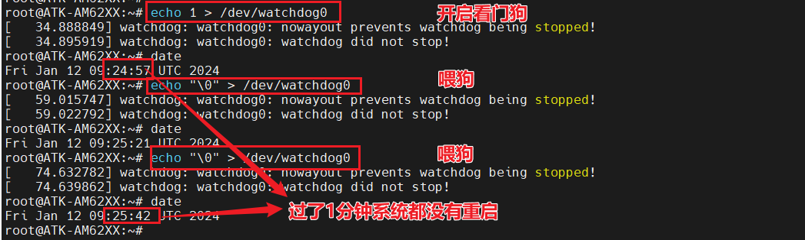
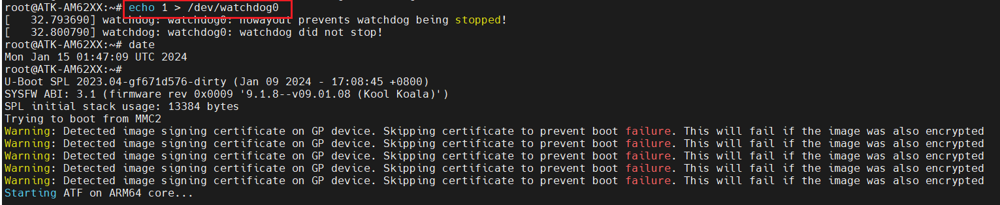

# 4.18 看门狗测试


&emsp;&emsp;ATK-DLAM62X开发板支持5个看门狗，本章节就教大家简单测试一下(**看门狗开启就不能关闭，只能一直喂狗，不喂狗就30秒后复位系统**)，测试命令如下所示：

```c#
echo 1 > /dev/watchdog    //开启看门狗
echo "\0" > /dev/watchdog //喂狗
```


<center>
<br />
图4.18.1 看门狗的使用(有喂狗)
</center>

<center>
<br />
图4.18.2 看门狗的使用(没有喂狗)
</center>

&emsp;&emsp;从图4.18.1和4.18.2中可以看出，如果我们在开启看门狗下，不喂狗系统会自动重启。