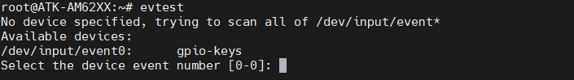
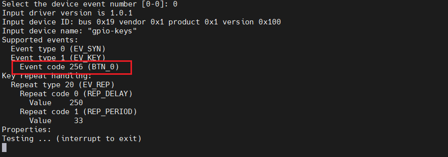
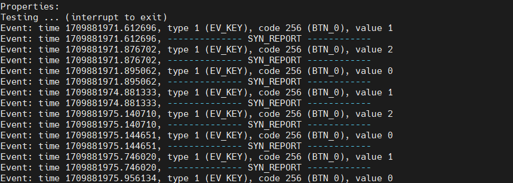

# 4.2 按键测试

&emsp;&emsp;ATK-DLAM62x开发板上配置了四个按键，它们分别是REST、M4_RST、A_KEY和M_KEY。从按键的名称上就可以直观地了解到它们各自的功能。其中，REST按键用于对A53核心进行复位操作，确保A53核心在特定情况下能够重新初始化；M4_RST按键则是针对M4F核心的复位键，同样用于实现M4F核心的复位功能。A_KEY按键是专门为A53核心设计的，用户可以通过该按键进行与A53核心相关的操作或触发相关事件；而M_KEY按键则是M4F核心所使用的按键，方便用户与M4F核心进行交互。

&emsp;&emsp;在出厂系统输入如下指令，控制A_KEY。命令如下：

```c#
evtest
```

<center>
<br />
图4.2.1 evtest界面
</center>


&emsp;&emsp;在图4.2.1中，告诉我们“/dev/input/event0”为gpio-keys的中断事件，直接输入0即可(**如果有多个输入设备的时候编号可能发生改变，需要根据实际情况输入编号**)


<center>
<br />
图4.2.2 按键键值
</center>

&emsp;&emsp;在图4.2.2中，红色框表示按键上报的按键值。按下按键即可出现内核的打印信息。如下图所示：

<center>
<br />
图4.2.3 按键测试
</center>


&emsp;&emsp;A_KEY连接CPU的IO为GPIO0_12(G21)，设备树在内核源码：**atk-linux-kernel-6.1.46/arch/arm64/boot/dts/alientek/alientek-am62xx-common.dtsi**。在根节点下(/)找到gpio-keys节点，如下示例代码所示：

```c#
示例代码4.2.1 alientek-am62xx-common.dtsi
1     gpio-keys {
2         compatible = "gpio-keys";
3         autorepeat;
4         pinctrl-names = "default";
5         pinctrl-0 = <&main_user_key_pins_default>;
6 
7         user: user {
8             label = "GPIO Key USER1";
9             linux,code = <BTN_0>;
10            gpios = <&main_gpio0 12 GPIO_ACTIVE_LOW>;
11        };
12    };
```

&emsp;&emsp;第9行中，我们设置了按键驱动向应用层提交的键值。这意味着当按键被按下或触发时，内核驱动会捕获这一事件，并将与之相关联的键值通过适当的接口或机制传递给应用层。应用层可以据此识别出特定的按键操作，并执行相应的功能或响应用户的操作。


