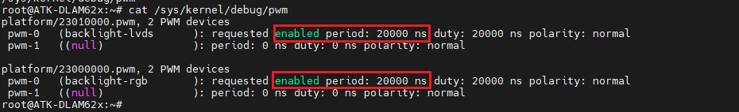
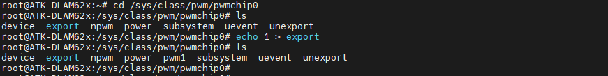
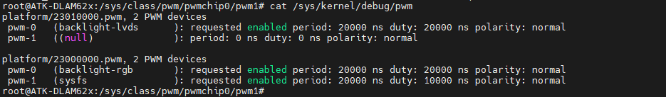

# 4.20 PWM测试


&emsp;&emsp;ATK-DLAM62x系列控制器配备了强大的PWM（脉冲宽度调制）功能，用于精确控制各种外设和接口。在AM62x中，特别提供了三组增强型PWM（EPWM）模块，每组包含两个PWM输出通道。这种设计使得开发者能够灵活地控制多个设备，同时保持对频率和占空比的精确调整。

&emsp;&emsp;每组EPWM模块共享相同的时钟源和频率设置，这意味着同一组内的两个PWM通道将具有相同的基频。然而，占空比（即脉冲宽度与周期的比值）可以在每个通道上独立设置，从而实现不同的输出波形。这种特性使得AM62x能够同时控制多个设备，并根据需要调整它们的工作状态。

&emsp;&emsp;通过配置EPWM模块的参数，开发者可以精确地设置PWM信号的频率、占空比、相位等属性。这些参数可以通过软件编程进行动态调整，以适应不同的应用场景和实时需求。

&emsp;&emsp;运行以下命令查看EPWM的使能：

```c#
cat /sys/kernel/debug/pwm
```

<center>
<br />
图4.20.1 查看EPWM信息
</center>

&emsp;&emsp;如上图所示，清晰地展示了ATK-DLAM62x开发板启用了两组增强型PWM（EPWM）模块。每组EPWM模块均已启用pwm0通道，这些通道均用于控制显示背光。EPWM0和EPWM1通道的周期均设置为20000ns(纳秒)。因此，若要使用这两组的pwm1通道，则需要将其周期设置为相同的20000ns。需要修改周期，请修改对应的RGB屏幕设备树或者LVDS屏幕设备树(alientek-am62xx-lvds.dtso和alientek-am62xx-rgb.dtso)。

&emsp;&emsp;出厂系统配置了EPWM1模块的pwm1通道，用于控制PWM接口风扇(没有购买风扇的请自行使用示波器去测试PWM接口)。我们使用以下命令进行测试PWM风扇：

```c#
cd /sys/class/pwm/pwmchip0
echo 1 > export
```

<center>
<br />
图4.20.2 开启EPWM1的PWM1通道
</center>

&emsp;&emsp;上图可以看出来，已经开启pwm1，因为多了一个pwm1文件夹。运行一下命令设置pwm1的周期和占空比，最后开启EPWM1模块的pwm1通道。命令如下所示：

```c#
echo 20000 > pwm1/period      //设置周期EPWM1的pwm1通道周期为20000ns
echo 10000 > pwm1/duty_cycle  //设置占空比EPWM1的pwm1通道占空比为10000ns
echo 1 > pwm1/enable          //开启pwm1
```

<center>
<br />
图4.20.3 开启pwm1
</center>

&emsp;&emsp;运行上图命令，即可看到PWM风扇正常开启。需要降低风扇的转数，请降低占空比即可。可以运行以下命令查看pwm1占空比：

```c#
cat /sys/kernel/debug/pwm
```

<center>
<br />
图4.20.4 查看EPWM信息
</center>

&emsp;&emsp;上图可以看出开启了EPWM0模块的pwm1通道，使用sysfs接口。周期为20000ns，占空比为10000ns。

&emsp;&emsp;关闭PWM风扇，如下命令所示：

```c#
echo 0 > pwm1/enable
```


