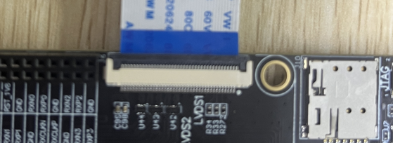
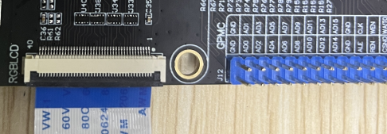
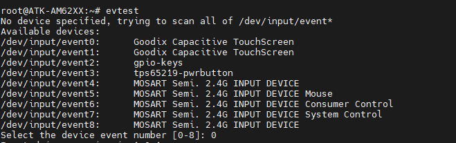
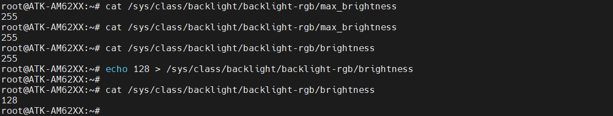

# 4.3 LCD测试

&emsp;&emsp;ATK-DLAM62x开发板有两个硬件显示接口LVDS和RGB(RGB565)。其中LVDS三种模式4lane、8lane和双4lane。出厂系统默认为4lane。

&emsp;&emsp;正点原子的RGB屏幕兼容RGB565可以直接使用RGB屏幕。由于正点原子屏幕在R、G和B数据线的最高位R7\G7\B7的默认高低电平状态识别不同屏幕的分辨率。正点原子所使用的RGB屏幕有5种，如下表格所示：

<div class="dlam62x_center-table-div">
<table class="dlam62x_center-table">
  <tr>
    <th>屏幕尺寸</th>
    <th>触摸芯片</th>
    <th>屏幕ID识别码</th>
  </tr>
  <tr>
    <td>4.3寸屏(480x272)</td>
    <td>gt9xx</td>
    <td>0x00</td>
  </tr>
  <tr>
    <td>4.3寸屏(800x480)</td>
    <td>gt9xx</td>
    <td>0x04</td>
  </tr>
  <tr>
    <td>7寸屏(800x480)</td>
    <td>gt9xx</td>
    <td>0x01</td>
  </tr>
  <tr>
    <td>7寸屏(1024x600)</td>
    <td>gt9xx</td>
    <td>0x02</td>
  </tr>
  <tr>
    <td>10寸屏(1280x800)</td>
    <td>gt9xx</td>
    <td>0x05</td>
  </tr>
</table>
</div>

&emsp;&emsp;在ATK-DLAM62x开发板的设计中，U-Boot启动加载器默认并不支持logo显示功能。为了满足特定的需求，我们在U-Boot内部增加了ID读取操作。这一操作允许系统在启动时识别并配置连接的RGB液晶显示屏。

&emsp;&emsp;为了灵活控制这一ID读取功能，我们提供了CONFIG_ALIENTEK_RGB_LCD宏。通过配置这个宏，用户可以选择使能或关闭ID读取操作。当关闭ID识别功能时，系统将默认使用1024x600分辨率的屏幕配置。

&emsp;&emsp;关于RGB屏幕的数据格式，本开发板采用的是RGB565格式，而非RGB888格式。

&emsp;&emsp;出厂时，显示相关的配置系统默认使用alientek-am62xx-rgb.dtso和alientek-am62xx-lvds1x.dtso（4lane）这两个设备树源文件。

&emsp;&emsp;硬件接法：

<center>
<br />
图4.3.1 LVDS 4lane接法图
</center>

<center>
<br />
图4.3.2 RGB565接法图
</center>

## 4.3.1 触摸测试

&emsp;&emsp;触摸测试很简单和按键一样使用evtest命令测试，在开发板的调试终端下，输入如下命令：

```c#
evtest
```

<center>
<br />
图4.3.1.1 屏幕触摸测试
</center>

&emsp;&emsp;/dev/input/event0为RGB屏触摸测试设备，/dev/input/event1为LVDS屏触摸测试设备。测试RGB屏幕触摸直接输入0，测试LVDS屏幕触摸直接输入1。

## 4.3.2 背光测试

&emsp;&emsp;在默认出厂系统，RGB屏幕和LVDS屏幕背光都支持256个等级的PWM调节，亮度级数为0~255，默认为255。设置为0时，关闭背光。数值越大，屏幕越亮。RGB屏幕测试代码如下所示：

```c#
cat /sys/class/backlight/backlight-rgb/max_brightness      //查看背光最大亮度等级
cat /sys/class/backlight/backlight-rgb/brightness          //查看当前亮度等级
echo 128 > /sys/class/backlight/backlight-rgb/brightness   //修改当前亮度等级
cat /sys/class/backlight/backlight-rgb/brightness          //查看当前亮度等级
```

&emsp;&emsp;测试如下图所示：


<center>
<br />
图4.3.2.1 RGB屏幕背光测试
</center>


&emsp;&emsp;**注意：测试LVDS的背光可以把上述的命令前缀/sys/class/backlight/backlight-rgb/修改为/sys/class/backlight/backlight-lvds/，前提是LVDS设备树正确加载。**

## 4.3.3 LVDS测试

&emsp;&emsp;出厂时，系统的默认配置(alientek-am62xx-lvds1x.dtso)并未启用LVDS显示功能，尽管设备树文件已正常加载。在启动weston时，我们发现LVDS屏幕并未激活，因此需要进行LVDS测试。为实现这一目标，我们需要对/etc/xdg/weston/weston.ini配置文件进行相应的修改，以确保LVDS屏幕能够在测试过程中被正确启用和使用。找到如下示例代码：

```c#
示例代码4.3.3.1 weston.ini
1 	[output]
2 	name=LVDS-1
3 	mode=off
4 
5 	[output]
6 	name=DPI-1
7 	mode=800x1280
```

&emsp;&emsp;把第3行的mode修改为800x1280(LVDS屏幕分辨率为800x1280)，如下代码所示：

```c#
mode= 800x1280
```

&emsp;&emsp;注意：当LVDS(LVDS-1)和RGB(DPI-1)屏幕同时开启，以LVDS屏为主屏，RGB屏为扩展屏(相对于Windows10系统接上2个屏幕)，如下示例代码所示：

```c#
示例代码4.3.3.2 weston.ini
1 	[output]
2 	name=LVDS-1
3 	mode=800x1280
4 
5 	[output]
6 	name=DPI-1
7 	mode=800x1280
```

&emsp;&emsp;如果要关闭RGB屏幕需要修改第7行为mode=off。如需深入了解显示相关的详细配置和使用方法，请参考【正点原子】提供的ATK-DLAM62x-LVDS和RGB使用指南。

