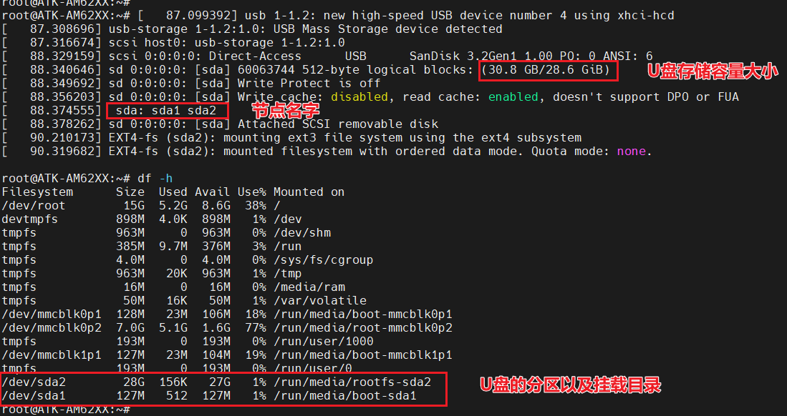
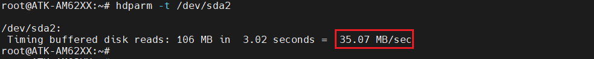
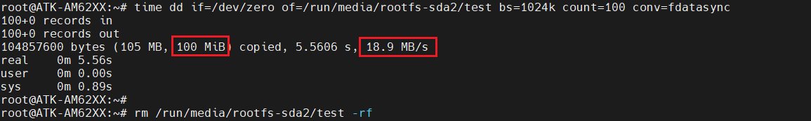
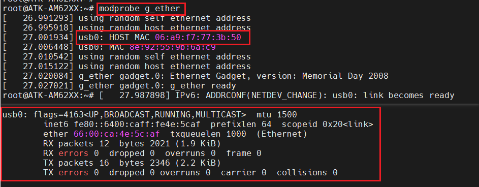
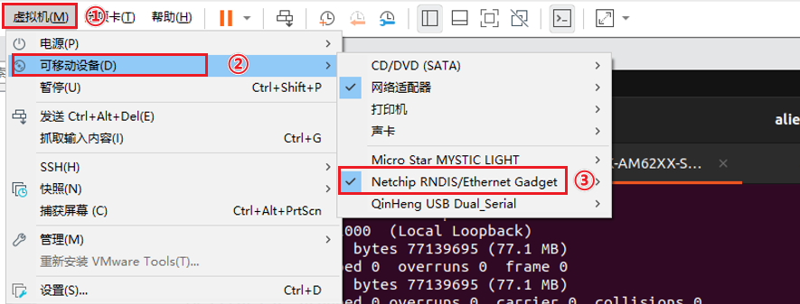
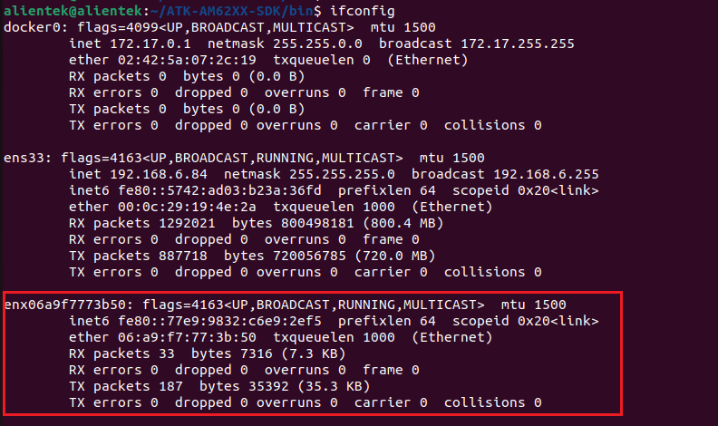
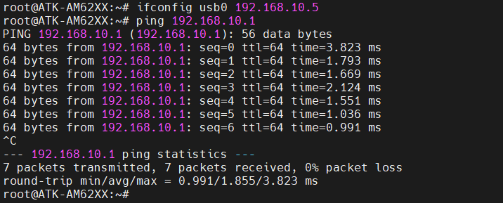

# 4.5 USB测试

## 4.5.1 USB HOST测试

&emsp;&emsp;将一张FAT32格式的U盘用读卡器，直接插在ATK-DLAM62X底板的USB_HOST1、USB_HOST2和USB_HOST3的USB接口上，如下图所示：

<center>
<br />
图4.5.1.1 U盘挂载的信息
</center>

&emsp;&emsp;我们可以直接进入/run/media/sda1目录进入读写文件操作。
读速度测试：

```c#
hdparm -t /dev/sda2
```

&emsp;&emsp;测试结果如下图所示：

<center>
<br />
图4.5.1.2 读取速度测试
</center>

&emsp;&emsp;写速度测试：

```c#
time dd if=/dev/zero of=/run/media/rootfs-sda2/test bs=1024k count=100 conv=fdatasync
rm /run/media/rootfs-sda2/test  //写完后删除写入的文件
```

&emsp;&emsp;测试结果如下图所示：

<center>
<br />
图4.5.1.3 写速度测试
</center>

&emsp;&emsp;这里代表写入100MiB的文件，写入速度为18.9 MB/s。实际上写入的文件越大求平均写入速度越接近实际值。

## 4.5.2 USB OTG测试(OTG网络)

&emsp;&emsp;ATK-DLAM62X底板上的USB-OTG接口，可当作USB网络使用(局域网)。我们使用一根USB Type-C连接线连接USB_OTG接口到PC(电脑)。

&emsp;&emsp;出厂系统默认没有开启OTG功能，所以我们需要运行以下代码加载驱动，使能OTG网络功能。如下所示：

```c#
modprobe g_ether //加载OTG网络驱动
ifconfig //查看网络节点
```

&emsp;&emsp;运行如下图所示：

<center>
<br />
图4.5.2.1 加载OTG驱动和查看网络节点
</center>

&emsp;&emsp;上图可以看出打印出主机的MAC地址。接着我们打开Ubuntu虚拟机，按如下步骤操作，将PC（电脑）识别的可移动设备连接到虚拟机上。

<center>
<br />
图4.5.2.1 将USB_OTG设备连接到Ubuntu虚拟机
</center>

&emsp;&emsp;使用命令查看Ubuntu系统下是否生成一个新的网络节点，如下命令所示：

```c#
ifconfig
```

<center>
<br />
图4.5.2.3 查看Ubuntu系统的usb网络节点
</center>

&emsp;&emsp;图4.5.2.3可以看出生成的网络节点是根据MAC地址命名的。图4.5.2.1和图4.5.2.3两个网络节点都没IP地址，所以不能通讯。给两端网口设置相同网段的IP地址，就可以相互通讯了。笔者这边就随便定义为：192.168.10.x网段，如下命令所示：

```c#
ifconfig usb0 192.168.10.5                 //开发板串口设置开发板的IP地址
sudo ifconfig enx06a9f7773b50 192.168.10.1 //在Ubuntu系统下设置IP地址
ping 192.168.10.1                          //使用ping命令去ping Ubuntu系统的网络
```

<center>
<br />
图4.5.2.4 设置IP地址和ping Ubuntu
</center>


