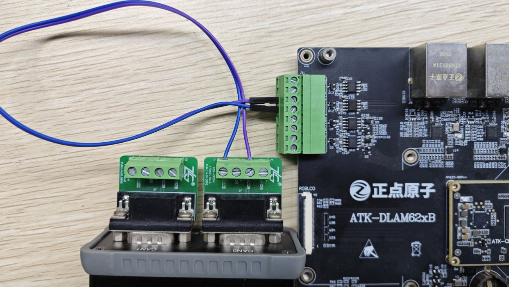
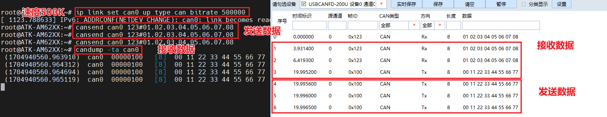
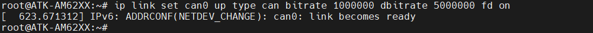
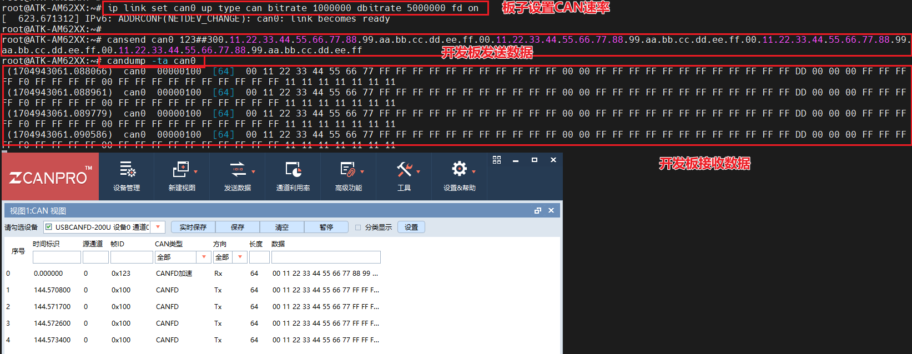

# 4.7 CAN测试


&emsp;&emsp;ATK-DLAM62X底板上有两路CAN 分别为A53核控制的CAN和M4核控制的CAN，本教程只测试A53核的CAN。要想测试CAN，用户手上需要有测试CAN的仪器，（否则只能用两块不同的开发板的CAN或者其他CAN设备测试）比如周立功的CAN分析仪、创芯科技的CAN分析仪和广成科技的CAN分析仪等。或者可用两个CAN设备对接相互收发。关于CAN仪器及CAN上位机的使用，请参照各厂商的使用说明书，如不会使用请咨询CAN厂家的技术支持。

&emsp;&emsp;ATK-DLAM62X开发板的CAN主要特性如下：<br />
&emsp;&emsp; - 符合CAN协议2.0A、B和ISO 11898-1标准。<br />
&emsp;&emsp; - 支持CAN FD(最多64个数据字节)。<br />
&emsp;&emsp; - 消息RAM的奇偶校验/ECC检查<br />
&emsp;&emsp; - 速度最高8Mbps

&emsp;&emsp;测试前请使用CAN分析仪或者测试CAN的设备连接好ATK-DLAM62X开发板的CAN，CANH接仪器的CANH，CANL接CAN仪器的CANL。

&emsp;&emsp;底板接口如下图位置

<center>

</center>

## 4.7.1 CAN测试

&emsp;&emsp;使用以下命令进行测试：

```c#
ip link set can0 up type can bitrate 500000
```

&emsp;&emsp;使用cansend指令发送数据。

&emsp;&emsp;解释：<br />
&emsp;&emsp;（1）	can0设备<br />
&emsp;&emsp;（2）	123：帧ID<br />
&emsp;&emsp;（3）	01.02.03.04.05.06.07.08：帧数据

&emsp;&emsp;接收则可以使用candump指令来接收数据

```c#
candump -ta can0
```

&emsp;&emsp;解释：<br />
&emsp;&emsp;（1）	-ta: t代表打印时间，a代表开启ASCII输出

&emsp;&emsp;使用ZLG USBCANFD 200U CAN分析仪设置CAN的速率为500000做的实验结果如下图

<center>
<br />
图4.7.2 使用上位机与开发板CAN收发
</center>

## 4.7.2 CAN FD测试

&emsp;&emsp;在上小节已经开启了CAN，如果不想重启开发板，可以用以下命令先关闭CAN。

```c#
ifconfig can0 down
```

&emsp;&emsp;配置CAN FD的速率，其它的速率自行测试。

```c#
ip link set can0 up type can bitrate 1000000 dbitrate 5000000 fd on
```

&emsp;&emsp;设置波特率为1000kBit/s，数据波特率为5000kBit/s进行测试。

<center>
<br />
图4.7.2.1 开发板设置CAN FD
</center>

&emsp;&emsp;CAN FD发送数据，请复制以下命令，要分行复制

```c#
cansend can0 123##300.11.22.33.44.55.66.77.88.99.aa.bb.cc.dd.ee.ff.00.11.22.33.44.55.66.77.88.99.aa.bb.cc.dd.ee.ff.00.11.22.33.44.55.66.77.88.99.aa.bb.cc.dd.ee.ff.00.11.22.33.44.55.66.77.88.99.aa.bb.cc.dd.ee.ff
```

&emsp;&emsp;解释：<br />
&emsp;&emsp;（1）	can0: can设备<br />
&emsp;&emsp;（2）	123: 帧ID<br />
&emsp;&emsp;（3）	3：标志（flags）<br />
&emsp;&emsp;（4）	00.11.22…: 帧数据

&emsp;&emsp;接收则可以使用candump指令来接收数据

&emsp;&emsp;解释：<br />
&emsp;&emsp;（1）	-ta: t代表打印时间，a代表开启ASCII输出

&emsp;&emsp;下面是使用ZLG USBCANFD 200U CAN分析仪使用波特率最高1000 kBit/s，数据波特率最高5000 kBit/s测试的结果。

<center>
<br />
图4.7.2.2 使用上位机与开发板CAN FD收发
</center>


