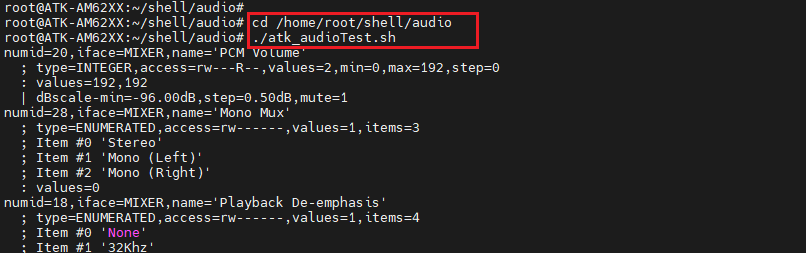
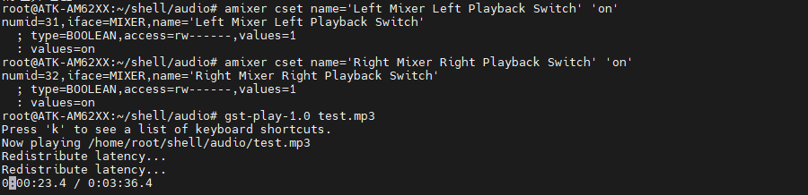
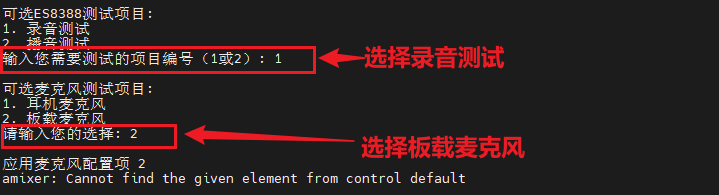

# 4.9 音频测试


&emsp;&emsp;ATK-DLAM62x开发板自带ES8388音频芯片。此芯片是一款高性能、低功耗、低成本的音频编解码器，具有广泛的应用领域。该芯片集成了两路ADC（模数转换器）和两通道DAC（数模转换器），同时还包括话筒放大器、耳机放大器、数字音效、模拟混合和增益功能，为音频处理提供了全面的解决方案。

&emsp;&emsp;ES8388的ADC和DAC均支持24位音频数据，取样频率范围从8千赫到96千赫，满足了各种音频应用的需求。其动态范围达到了95分贝（ADC）和96分贝（DAC），信噪比同样优秀，为音频信号提供了清晰、准确的传输。此外，ES8388还具备自动电平控制和噪声门等功能，有效抑制了背景噪声和干扰信号，提高了音频的纯净度。

&emsp;&emsp;出厂系统预置的alsa-config.service服务，其核心功能在于实现音频链路的开机自启与初始化。当系统启动时，alsa-config.service会自动运行，执行一系列预设的音频配置操作，确保音频硬件能够正确加载并处于最佳工作状态。如果需要关闭此功能，运行以下
命令：

```c#
systemctl stop alsa-config.service
```

## 4.9.1 播放测试

&emsp;&emsp;出厂系统预装了音频测试脚本，用于在终端中快速运行音频测试以检验音频设备的工作状态。为了运行这个测试脚本，用户需要执行一系列步骤，首先跳转到特定的脚本存放目录(/home/root/shell/audio)，然后执行脚本文件。命令如下所示：

```c#
cd /home/root/shell/audio
./atk_audioTest.sh
```

<center>
<br />
图4.9.1.1 音频播放脚本测试
</center>

&emsp;&emsp;根据shell脚本的提示，输入2在按回车键，实现音频播放测试，播放音频文件为当前目录下的test.mp3文件。可以不用脚本直接配置，命令如下所示：

```c#
amixer cset name='Left Mixer Left Playback Switch' 'on'
amixer cset name='Right Mixer Right Playback Switch' 'on'
gst-play-1.0 test.mp3
```

<center>
<br />
图4.9.1.2 音频播放命令测试
</center>

## 4.9.2  录音测试

&emsp;&emsp;录音和播放一样，使用脚本即可录音，首先跳转到特定的脚本存放目录(/home/root/shell/audio)，命令如下所示：

```c#
cd /home/root/shell/audio
./atk_audioTest.sh
```

&emsp;&emsp;根据shell脚本提示，输入对应的数字1再按回车键，后面就会出现提示耳机和板载mic录音选择。如下图所示：

<center>
<br />
图4.9.2.1 录音测试
</center>

&emsp;&emsp;会直接录制5秒钟的音频数据，然后脚本就会自动播放此音频文件，最后会生成record.wav文件，存储到当前目录。耳机录音测试，直接接上耳机然后根据脚本选择耳机测试。

&emsp;&emsp;我们也可以通过命令配置耳机麦克风和板载麦克风录音测试，板载麦克风链路初始化命令如下所示：

```c#
amixer cset name='Differential Mux' 'Line 2'
amixer cset name='Left Line Mux' 'Line 2L'
amixer cset name='Right Line Mux' 'Line 2R'
```

&emsp;&emsp;耳机麦克风链路初始化命令如下所示：

```c#
amixer cset name='Differential Mux' 'Line 1'
amixer cset name='Left Line Mux' 'Line 1L'
amixer cset name='Right Line Mux' 'NC'
```

&emsp;&emsp;在输入以下命令进行录音初始化测试：

```c#
amixer cset name='Left Mixer Left Bypass Switch' 'on'
amixer cset name='Right Mixer Right Bypass Switch' 'on'
amixer cset name='Left Mixer Left Playback Switch' 'off'
amixer cset name='Right Mixer Right Playback Switch' 'off'
```

&emsp;&emsp;如果耳机录音测试需要先初始化耳机麦克风链路，在运行录音初始化，最后运行以下命令进行录音测试：

```c#
arecord -f cd -d 5 record.wav
```

&emsp;&emsp;录制5秒钟的wav音频文件，格式为：采样率44100 Hz，位深度16位，声道双声道，小端。


