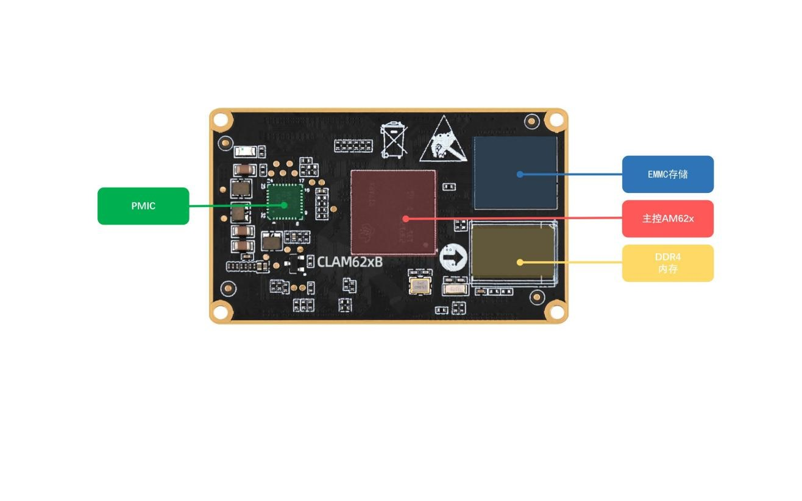

# 2.1 硬件参数

| **参数项**     | **参数**                      | **备注**                                                     |
| :------------: | :---------------------------: | ------------------------------------------------------------ |
| 尺寸规格       | 58mm*35mm                     | 长*宽                                                        |
| CPU            | TI Sitara AM6254/6252/6231    | FCCSPBGA (ALW)                                               |
| 内存           | 1/2GB DDR4                    | 贴片封装。受芯片供货影响，可能会有多种不同厂家的芯片，一切以实际贴片的型号为准。 |
| 存储           | 16G                           | 贴片封装。受芯片供货影响，可能会有多种不同厂家的芯片，一切以实际贴片的型号为准。 |
| 电源管理芯片   | TPS6521903                    |                                                              |
| 工作电压（1）  | 3.3V                          |                                                              |
| 功耗(2)        | ≤2.2W                         | 静态功耗，具体功耗取决于外设                                 |
| 运行温度       | 工业级-40℃~+85℃               |                                                              |
| 引脚间距       | 0.4mm                         |                                                              |
| 核心板连接方式 | BTB                           | 连接器：DF40C-80DP-0.4V(51)，公座                            |
| PCB工艺        | 8层，沉金工艺，独立接地信号层 | 采用无铅工艺                                                 |

&emsp;&emsp;注：（1）核心板的功耗数据是由环境12V/2.5A输入，只接串口UART1，不接其他外设。具体功耗数据取决于开发板所接的外设。

 
图 2.1.1 核心板资源

