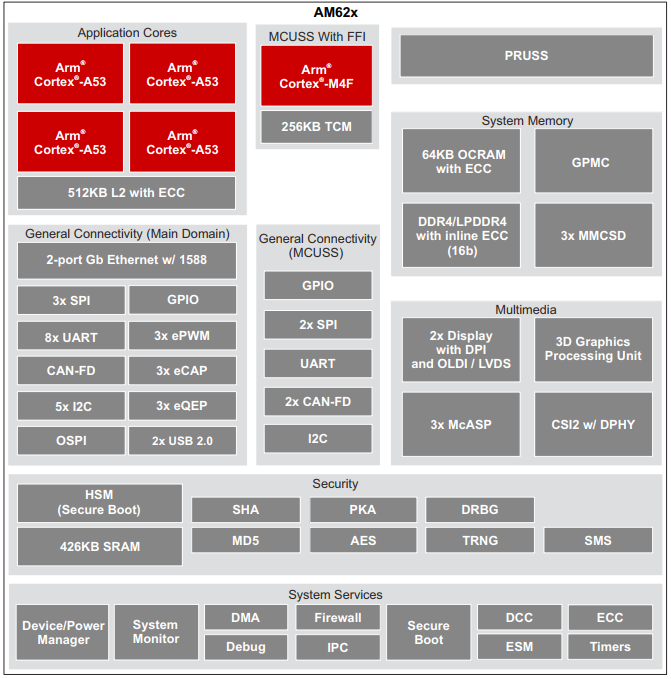

# 2.2 AM62xB芯片参数

 
图 2.2.1 芯片资源

&emsp;&emsp;具体细节参数可以参考AM62x芯片手册。

| 处理器   | 四核/双核/单核Cortex-A53，1.4GHz                             | GPU          | OpenGL ES 3.1、 Vulkan 1.2                                   |
| :------: | :----------------------------------------------------------- | :----------: | :----------------------------------------------------------- |
| MIPI CSI | 1-lane/2-lane/3-lane/4-lane  @2.5Gbps/lane                   | LVDS         | 支持165MHz像素时钟；  支持2个4lane  LVDS，最高支持1920x1080@60fps； |
| RGB      | 24bit并行接口，  最高支持1920x1080@60fps；  高达165MHz的像素时钟 | USB 2.0 HOST | × 2，  支持高速(480Mbps)、全速(12Mbps)和低速(1.5Mbps)模式    |
| MMC      | × 3，  支持EMMC 5.1、SD  3.0和SDIO 3.0；                     | Ethernet     | × 2，  10/100/1000M RGMII  10/100 RMII                       |
| UART     | × 9，  波特率最高支持3.6Mbps                                 | I2C          | × 6，  支持7bit和10bit地址模式  数据传输速率支持100Kbit/s、400Kbit/s、3.4Mbit/s |
| SPI      | × 5  最高支持50MHz工作频率                                   | OSPI/  QSPI  | 可配置为8通道OSPI/4通道QSPI；  最高支持166MHz工作频率        |
| GPMC     | × 1，  支持133MHz速率；  支持8/16位异步存储器接口            | CAN          | × 3，  符合CAN协议2.0A、B和  ISO 11898-1标准；  支持CAN FD(最多64个数据字节)；  最高支持8Mbps |
| McASP    | × 3,  支持高达50MHz的发送和接收时钟；  具有多达16/10/6个串行数据引脚并有独立的TX和RX时钟； | ePWM         | × 3，  每路PWM支持两个ePWM输出，  每路具有专用16位时机计数器 |
| Timer    | × 12，  最高支持12路通用定时器                               | eCAP         | × 3，  最高支持3个增强型捕捉模块                             |
| JTAG     | × 1，  支持IEEE 1149.1 和IEEE 1149.6标准；                   | eQEP         | × 3，  最高支持3个增强型正交编码器脉冲模块                   |

