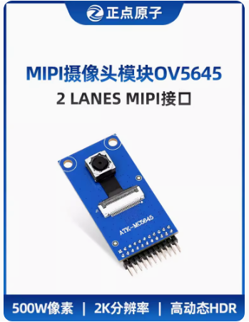

# 7.4 ATK-MCOV5645摄像头

&emsp;&emsp;正点原子MIPI摄像头模块ATK-MCOV5645 500W像素2K分辨率2592*1944。

&emsp;&emsp;购买链接：
https://detail.tmall.com/item.htm?abbucket=12&id=753708301367&rn=d00d01d5e615a98e4229de0bb9fb4ad8&spm=a1z10.3-b-s.w4011-24686329152.12.3f137467QyqVE2

 
图 7.4.1 ATK-MCOV5645摄像头

