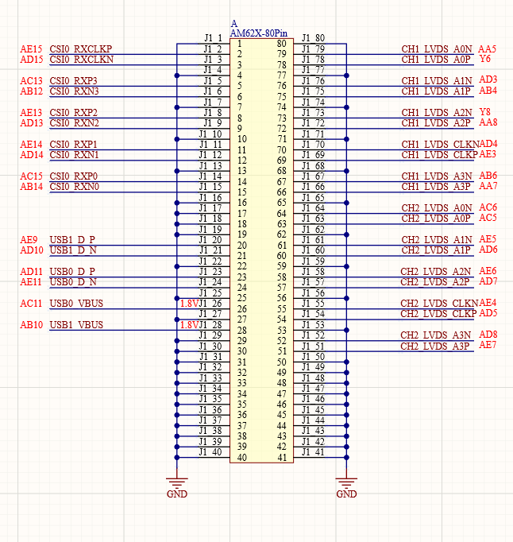
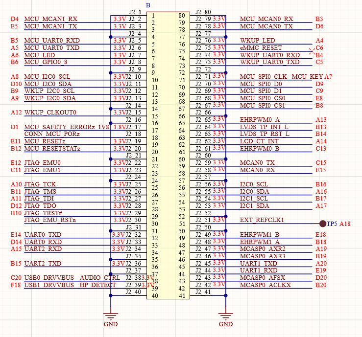
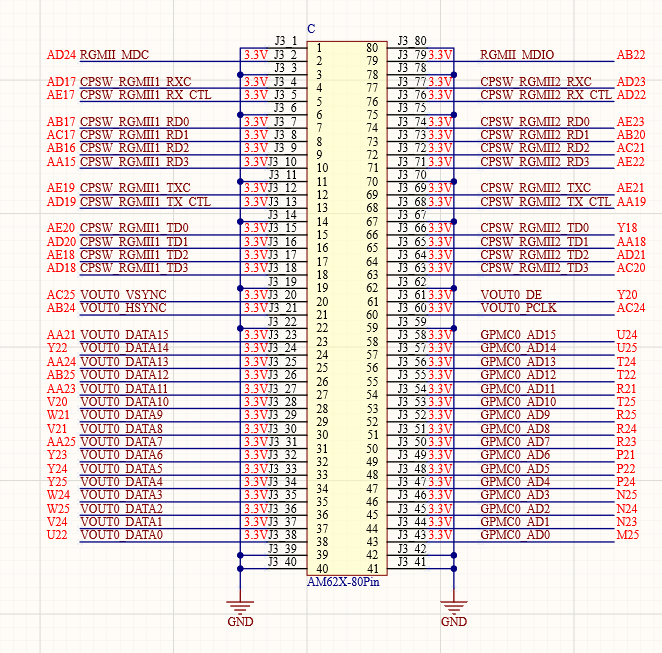
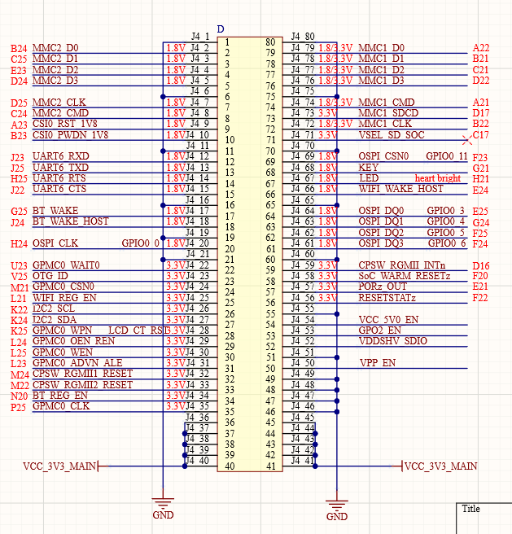

# 3.1 核心板接口 

&emsp;&emsp;ATK-DLAM62xB开发板采用底板+核心板的形式，ATK-AM62xB开发板底板采用4个2*40的板对板连接器与核心板连接，接插非常方便。底板连接座型号为：DF40C-80DS-0.4V(51)，母座，pin数 80 P，间距0.4mm，合高1.5mm。核心板接口原理图如图所示：

 
图 3.1-1 BTB接口-A

 
图 3.1-2 BTB接口-B

 
图 3.1-3 BTB接口-C

 
图 3.1-4 BTB接口-D

