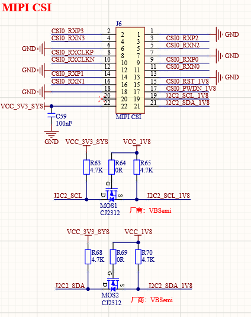

# 3.12  摄像头模块接口  

&emsp;&emsp;ATK-DLAM62x开发板板载了一个MIPI CSI摄像头模块接口，其原理图如图所示：

 
图 3.12-1 MIPI CSI接口

&emsp;&emsp;核心板支持1路MIPI DPHY 4Lanes输入接口，底板通过J6 2*11P 2.0mm 间距排座引出4Lanes。支持正点原子OV5645-MIPI摄像头模块。其中，I2C2_SCL_1V8和I2C2_SDA_1V8是摄像头的IIC接口，它们是由I2C2_SCL和I2C2_SDA经过电平转换而来的。