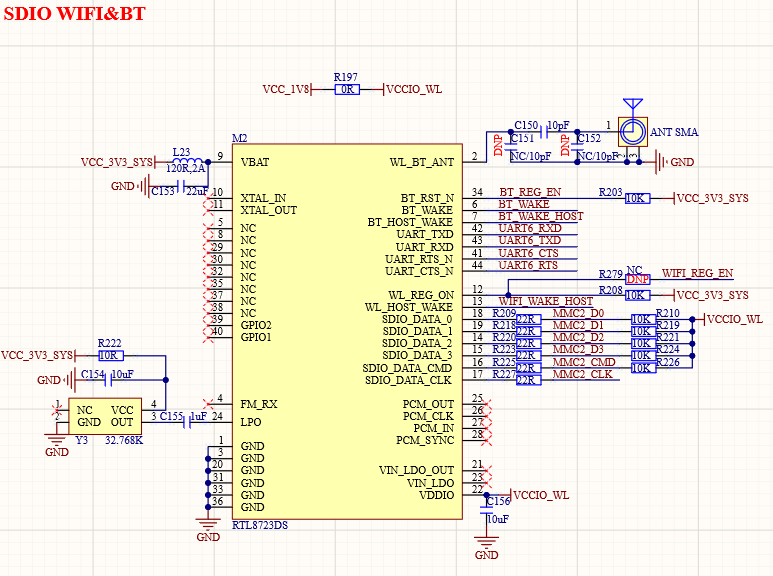

# 3.14  SDIO WIFI&蓝牙模块

&emsp;&emsp;ATK-DLAM62x开发板板载一个SDIO WIFI&蓝牙模块，如图1.3.20.1所示：

 
图 3.14-1 SDIO WIFI&BT模块接口

&emsp;&emsp;WIFI&蓝牙模块使用RTL8723DS，这是一个SDIO接口的WIFI&蓝牙模块，连接到了核心板的的SDMMC2接口上，SDMMC2_D0~D3/CMD/CLK分别连接到了ATK-DLAM62xB的B24/C25/E23/D24/C24/D25引脚上。蓝牙部分使用到了串口，模块的UART_TXD/UART_RXD/UART_RTS/UART_CTS连接到了STM32MP157的UART6串口上。BT_REG_EN/BT_WAKE/BT_WAKE_HOST/WIFI_REG_EN/WIFI_WAKE_HOST这5个IO连接到了ATK-DLAM62xB的N20/G25/J24/L21/E24这5个引脚上。