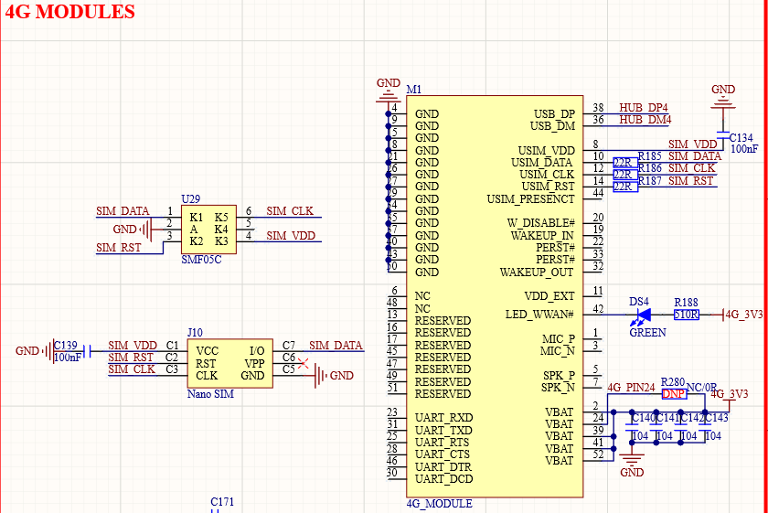

# 3.15  4G模块接口

&emsp;&emsp;ATK-DLAM62x开发板板载4G Mini PCIE接口，如图所示：

 
图 3.15-1 4G模块接口

&emsp;&emsp;M1就是Mini PCIE接口的4G模块座子，用于连接Mini PCIE接口的4G模块，比如高新兴的ME3630模块。U29是Nano SIM卡座，用于插入Nano SIM卡。4G模块虽然采用Mini PCIE接口，但是实际走的USB接口，这里连接到了CH334R扩展出来的一个USB HOST接口上。