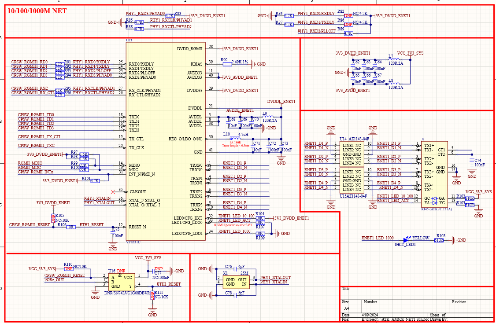
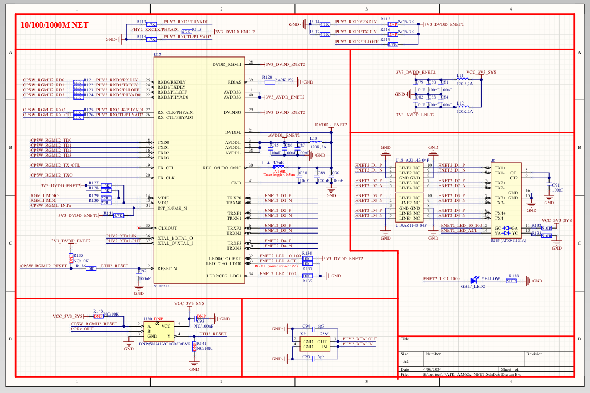

# 3.17  千M以太网接口（RJ45）

&emsp;&emsp;ATK-DLAM62x开发板板载了2个千M以太网接口(RJ45)，自适应10/100/1000M网速，原理图如图所示：

 
图 3.17-1 网口1

 
图 3.17-2 网口2

&emsp;&emsp;在自行设计底板时需注意： 
&emsp;&emsp;1、RGMII IO电平为3.3V，PHY芯片端需要将接口电平设置为3.3V； 
&emsp;&emsp;2、两个PHY为同一组MDC MDIO接口，因此在设计时要确保phy不能一致；  
&emsp;&emsp;3、PCB Layout需要尽量将PHY靠近核心板，并且保证RGMII信号参考平面完整，需要保证PHY芯片外围电源参考平面完整；  
&emsp;&emsp;4、等长要求： RGMII 的接收和发送可分组等长，等长要求≤2.5mm；  
&emsp;&emsp;5、阻抗要求：单端 50ohm； 

