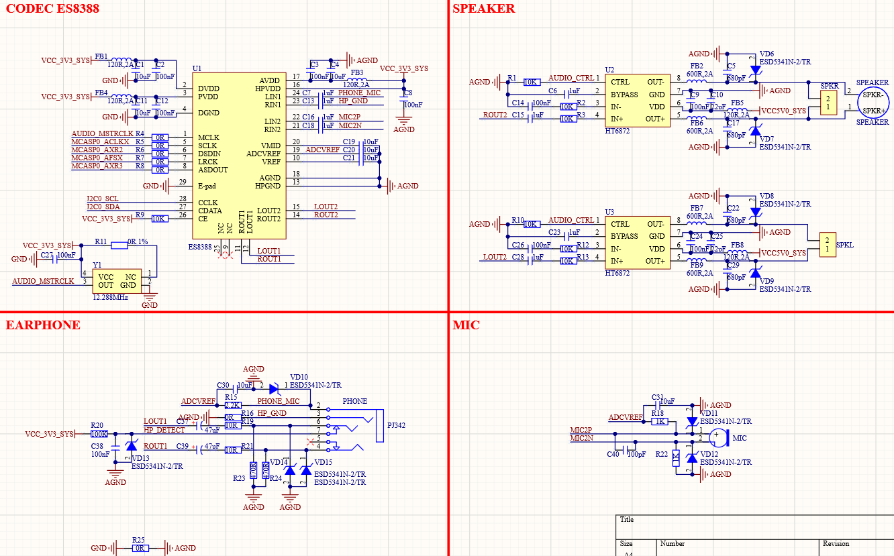

# 3.18  SAI音频编解码器 

&emsp;&emsp;ATK-DLAM62x开发板板载ES8388高性能音频编解码芯片，其原理图如图所示： 

 
图 3.18-1 音频接口

&emsp;&emsp;图1.3.24.1中，HT6872是有一个单声道D类音频功放，因为ES8388不支持喇叭，因此需要外置喇叭驱动电路。SPK-和SPK+连接了一个板载的8Ω 1W小喇叭。麦克风有两种选择，一个是耳机自带的MIC，一个是板载的咪头。PHONE是一个四段式3.5mm耳机输出接口，可以用来插耳机。

&emsp;&emsp;该芯片采用SAI接口与核心板连接，ES8388需要一个I2C接口去配置，这里使用核心板的的I2C0。

