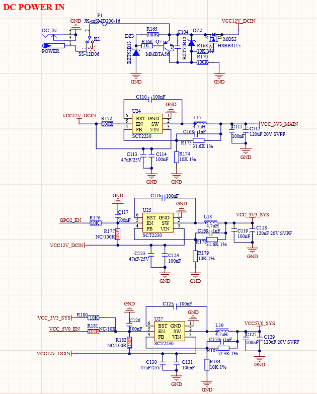

# 3.19  电源 

&emsp;&emsp;ATK-DLAM62x开发板板载的电源供电部分，其原理图如图所示：

 
图 3.19-1 电源模块

&emsp;&emsp;如图，开发板使用12V电源适配器供电，由K1拨动开关进行开关控制。其中，F1为自恢复保险丝，用于过流保护。在F1后面是一段限幅电路输出VCC12V_DCIN用于给3个DCDC电源芯片供电。其中U24是将输入的12V电压转换成3.3V用于核心板供电，U25将输入的12V电压转换成3.3V用于底板3.3V设备供电，U27将输入的12V电压转换成5.0V用于底板5.0V设备供电。

