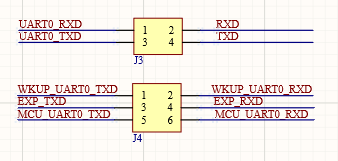

# 3.2 USB串口选择接口

&emsp;&emsp;ATK-DLAM62x开发板板载的USB串口和核心板的串口是通过J3、J4连接起来的，如图所示：

 
图 3.2-1 USB串口选择接口

&emsp;&emsp;J3连接的是A核的串口，将J3的1，2引脚相连和3，4引脚相连就可以进行开发板对A核的串口调试；J4连接的是R核和M核串口，将J4的1，3相连和2，4相连，USB接口就连接到了R核的串口，将J4的3，5引脚相连和4，6引脚相连，USB接口就连接到了M核的串口。

