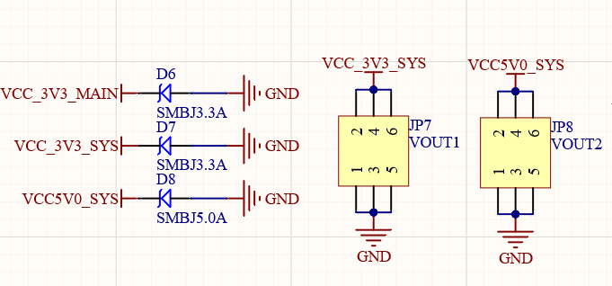

# 3.20  电源输出接口   

&emsp;&emsp;ATK-DLAM62x开发板板载了两组简单电源输入输出接口，其原理图如图所示：

 
图 3.20-1 电源输出接口

&emsp;&emsp;图中，VOUT1和VOUT2分别是3.3V和5V的电源输入输出接口，有了这2组接口，我们可以通过开发板给外部提供 3.3V和5V电源了，大家在调试自己的小电路板的时候，有这两组电源还是比较方便的。同时这两组端口，也可以用来由外部给开发板供电。

&emsp;&emsp;图中D6/D7/D8为TVS管，可以有效避免VOUT外接电源/负载不稳的时候（尤其是开发板外接电机/继电器/电磁阀等感性负载的时候），对开发板造成的损坏。同时还能一定程度防止外接电源接反，对开发板造成的损坏。

