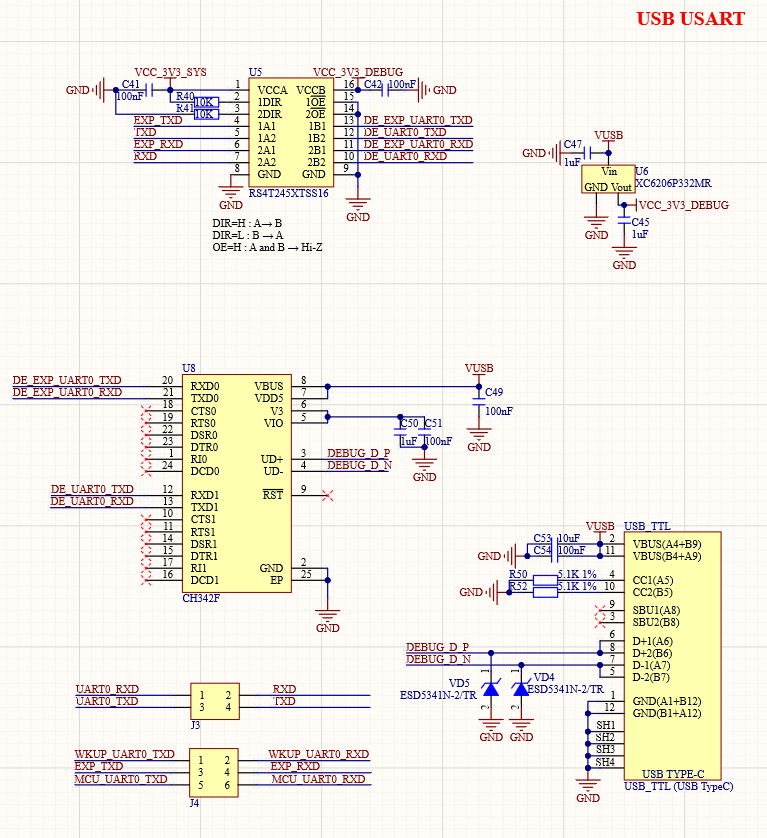

# 3.21  USB串口(Type-C接口)   

&emsp;&emsp;ATK-DLAM62x开发板板载了一个USB串口，其原理图如图所示：

 
图 3.21-1 USB 串口

&emsp;&emsp;图中U8为CH342F，一转二USB转串口芯片，将CPU 的UART0与WKUP_UART0/MCU_UART0转为USB信号连接至USB_TTL接口。图中U5为隔离芯片，用于防止在核心板未启动时UART信号反向管电流到核心板，影响核心板启动。

