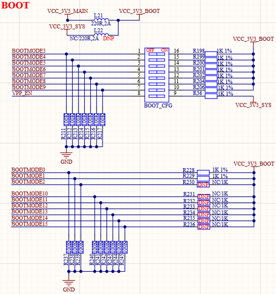

# 3.5  启动模式设置接口

&emsp;&emsp;ATK-DLAM62x开发板的启动模式设置端口电路如图所示：

 
图 3.5-1 启动模式选择

&emsp;&emsp;ATK-DLAM62x支持从多种不同的设备启动，通过设置拨码开关可以选择从指定的设备启动，启动方式如表所示：

| **BOOT1** | **BOOT2** | **BOOT3** | **BOOT4** | **BOOT5** | **BOOT6** | **BOOT7** | **启动模式** |
| :-------: | :-------: | :-------: | :-------: | :-------: | :-------: | :-------: | :----------: |
| 0         | 1         | 0         | 1         | 0         | 0         | 1         | USB(DFU)     |
| 0         | 1         | 0         | 1         | 0         | 1         | 1         | USB(HOST)    |
| 0         | 0         | 0         | 1         | 0         | 0         | 1         | MicroSD      |
| 0         | 0         | 0         | 1         | 0         | 0         | 0         | EMMC(UDA)    |
| 1         | 0         | 0         | 1         | 0         | 0         | 0         | EMMC(BOOT)   |

&emsp;&emsp;正点原子ATK-DLAM62x开发板上支持USB、SD卡、EMMC这3种启动方式。

