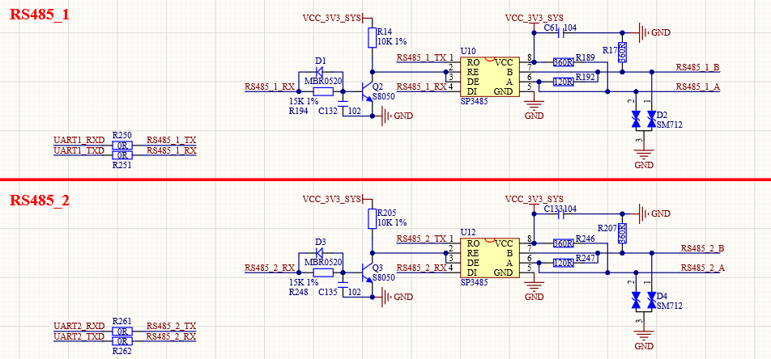

# 3.6  RS485接口

&emsp;&emsp;ATK-DLAM62x开发板板载的RS485接口电路如图所示：

 
图 3.6-1 RS-485接口

&emsp;&emsp;RS485电平不能直接连接到STM32MP157，需要电平转换芯片。这里我们使用SP3485来做485电平转换，其中R192/R247为终端匹配电阻，而R17/R189和R207/R246则是两个偏置电阻，以保证静默状态时485总线维持逻辑1。