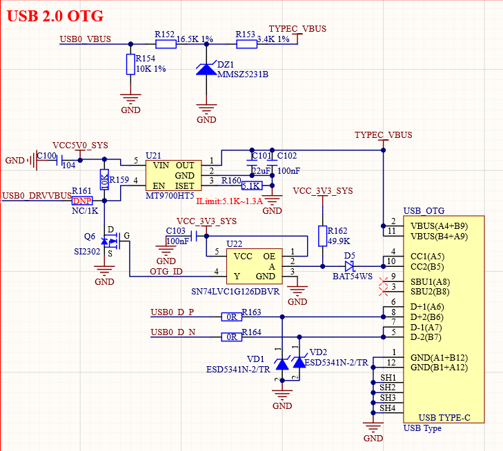

# 3.9  USB OTG(Type-C)接口

&emsp;&emsp;ATK-DLAM62x也有一路USB OTG接口，USB OTG接口使用了ATK-DLAM62x的USB0，USB OTG接口如图所示：

 
图 3.9-1 USB OTG接口

&emsp;&emsp;此路 USB OTG 既可以作为主机(HOST)，也可以作为从机(DEVICE)，从而实现完整的 OTG 功能。

&emsp;&emsp;从机(DEVICE)模式：图中 R162 这一个 49.9K 的电阻，默认将 OTG_ID 线拉高，当 ID 线为高的时候就表示 OTG工作在从机模式。此时由于OTG_ID为高电平，因此 MOS1(SI2302)导通，因此 MT9700HT5 的 EN 脚就接地，此时MT9700HT5的OUT引脚就没有输出，所以 USB_OTG_VBUS 电压关闭。 USB_OTG_VBUS电压用于在OTG做HOST 功能的时候，向外部设备提供5V电源很明显在OTG做从机的时候，OTG就不需要向外界提供 USB_OTG_VBUS 电源了。这里使用MT9700HT5这个芯片来实VBUS电源的开关控制。 

&emsp;&emsp;主机(HOST)模式：如果要使用OTG的HOST功能，那么必须要使用到Type-C OTG线。Type-C OTG线会将CC1和CC2拉低，因此OTG_ID线也会被拉低，当ID线为0的时候就表示OTG工作在主机模式。此时由于OTG_ID为低，因此MOS1(SI2302)不导通，因此 MT9700HT5的EN脚就会被R159这个10K电阻上拉到5V，所以MT9700HT5 的OUT引脚就会输出5V电压，也就是说TYPEC-VBUS此时是 5V，可以向外部设备提供5V电源。

